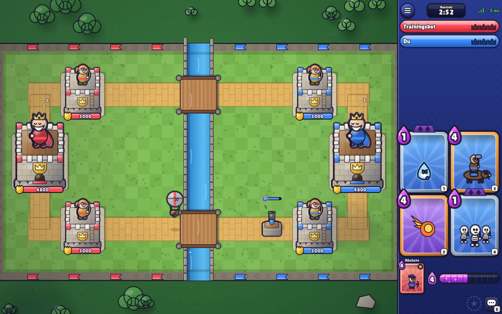
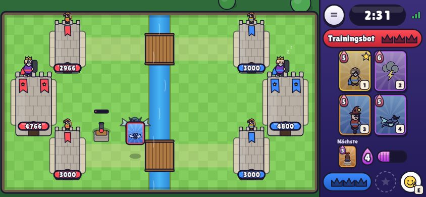
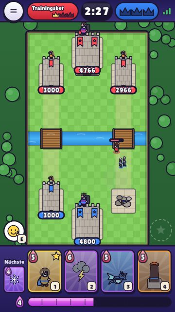

# Turmtrubel

**Turmtrubel** ist ein 1v1-Echtzeit-Kartenspiel für den Browser: zwei Lanes, ein Fluss mit zwei Brücken, drei Türme pro Seite, Elixier, Karten ziehen und platzieren. Das Spielprinzip lehnt sich eng an bekannte Tower-Rush-Kartenspiele an. Alle Namen, Karten, Figuren, Grafiken und Sounds sind eigene Entwürfe; Grafik und Ton werden komplett im Code erzeugt, es gibt keine Bild- oder Audiodateien.



<p>
  
  
</p>

---

## Schnellstart

Voraussetzung: **Node.js 18.17 oder neuer**.

```bash
cd turmtrubel
npm install
npm start
```

Dann im Browser **http://localhost:3000** öffnen.

* **Mit einem Freund im selben WLAN:** Beide öffnen `http://<IP-des-Rechners>:3000` (die IP zeigt z. B. `ipconfig` bzw. `ip addr`). Einer tippt auf *Kampf erstellen* und nennt dem anderen den 6-stelligen Code. Alternativ *Link teilen*: Der Link enthält den Code, der Beitritt läuft dann automatisch.
* **Übers Internet:** Den Server auf einem VPS oder Hoster mit WebSocket-Unterstützung starten (z. B. hinter nginx/Caddy mit HTTPS; `wss://` wird automatisch genutzt) oder zum Testen einen Tunnel verwenden.
* **Alleine testen:** *Training gegen Bot* im Hauptmenü. Oder zwei Browser-Tabs öffnen: Jeder Tab ist ein eigener Spieler.

| Variable | Standard | Bedeutung |
| -------- | -------- | --------- |
| `PORT` | `3000` | HTTP- und WebSocket-Port |
| `HOST` | `0.0.0.0` | Bind-Adresse |

`npm run dev` startet den Server mit automatischem Neustart bei Codeänderungen. `npm test` führt die Tests aus.

---

## Steuerung

| Aktion | Maus / Touch | Tastatur |
| ------ | ------------ | -------- |
| Karte spielen | Karte aufs Feld **ziehen** *oder* Karte **antippen**, dann Feld antippen | `1`–`4` wählt die Karte, dann Klick aufs Feld |
| Auswahl abbrechen | Karte erneut antippen oder zurück auf die Hand ziehen | `Esc` |
| Champion-/Helden-Fähigkeit | runder Knopf neben dem Emote-Knopf (Kartenpanel bzw. neben der Arena) | `Leertaste` oder `Q` |
| Emote | Smiley-Knopf, dann eines von 6 Emotes | `E` |
| Menü, Ton, Aufgeben | `≡` oben links bzw. oben im Kartenpanel | – |

Solange eine Karte ausgewählt ist, ist der gesperrte Bereich rot schraffiert, die Elixierleiste markiert die Kosten, und eine Vorschau zeigt Formation, Reichweite bzw. Zauberradius. Liegt der Finger auf der gegnerischen Hälfte, rastet die Truppe am Flussufer ein.

**Layouts:** Kein Bedienelement liegt über der Arena. Bei *Auto* wählt das Spiel die größte lesbare Arena. Auf breiten Bildschirmen (Desktop, Handy quer) ist die Arena um 90° gedreht (die eigene Seite liegt rechts), das Kartenpanel mit Timer, Kronen und Hand steht rechts. Auf Tablets quer steht die Arena hochkant mit Panel rechts, im Hochformat gibt es oben eine Kopfleiste und unten die Hand. Einstellbar unter *Einstellungen → Grafik & Anzeige → Arena-Ausrichtung*.

---

## Spielregeln

* **Arena:** 18 × 32 Felder, zwei Lanes, Fluss in der Mitte, zwei Brücken. Bodentruppen kommen nur über die Brücken hinüber (Ausnahme: der *Borstenreiter* springt).
* **Türme:** pro Spieler 2 **Wachtürme** (entsprechen den Prinzessinnentürmen, 3000 LP) und 1 **Burgturm** (Königsturm, 4800 LP). Der Burgturm schläft, bis er Schaden nimmt oder ein eigener Wachturm fällt.
* **Elixier:** Start bei 5, maximal 10, +1 alle 2,8 s. In der letzten Minute doppelt so schnell, in der Verlängerung dreifach.
* **Dauer:** 3 Minuten. Bei Kronengleichstand folgen 2 Minuten **Verlängerung mit Sudden Death**: Der erste zerstörte Turm gewinnt. Steht es danach immer noch gleich, verliert der Spieler mit dem Turm mit den wenigsten Lebenspunkten; sind auch diese gleich, endet das Spiel unentschieden.
* **Kronen:** 1 pro Wachturm, 3 für den Burgturm (sofortiger Sieg). Aufgeben oder eine Trennung von mehr als 30 s werten ebenfalls als 3 Kronen für den Gegner.
* **Deck:** 8 Karten, 4 auf der Hand, die nächste wird angezeigt. Die gespielte Karte wandert ans Ende der Warteschlange, die nächste rückt in den freien Platz nach (Rotation wie im Original).
* **Platzieren:** Truppen und Gebäude nur auf der eigenen Hälfte, Zauber überall. Fällt ein gegnerischer Wachturm, wird in seiner Lane eine *Tasche* auf der Gegnerseite freigeschaltet.
* **Truppen-KI:** Einheiten laufen zum nächsten Ziel ihres Typs (Boden, Luft, Gebäude) und suchen den Weg per A* über die Brücken. Sie greifen Gegner an, die in Sichtweite kommen (Ausnahme: Gebäudejäger), und bleiben am Ziel, solange es in Reichweite ist.

### Kartenarten

70 Karten, alle von Anfang an freigeschaltet und auf maximaler Stufe:

| Art | Anzahl | Beispiele |
| --- | ------ | --------- |
| Truppen | 35 | Knappe, Zwillingsschützinnen, Knochenlegion, Steinkoloss, Bombenzeppelin, Glutwal, Tunnelgräber |
| Gebäude | 9 | Donnerbüchse, Blitzmast, Glutschlund, Wichtelhütte, Elixierbrunnen, Steinschleuder, Belagerungsballiste, Barrikade |
| Zauber | 14 | Glutball, Pfeilhagel, Funkenschlag, Eishauch, Sumpfnebel, Leimregen, Kettenblitz, Gewitterzorn, Heilregen, Rollstamm |
| Champions | 6 | Aktive Fähigkeit, die **Elixier kostet** und eine **Abklingzeit** hat. Die Karte kehrt erst nach dem Tod des Champions in den Zyklus zurück. |
| Helden | 6 | Starke Einheit mit **einmaliger** Spezialfähigkeit (kostenlos, einmal pro Einsatz) |
| Evo-Karten | 15 | Liegt eine solche Karte in einem der **2 Evo-Plätze**, lädt sie sich durch Ausspielen auf. Nach `cycles` Einsätzen kommt die nächste als **Evo** mit Zusatzeffekt, anderen Farben, violetter Aura und Glitzer. |

Seltenheiten: Gewöhnlich, Selten, Episch, Legendär. Sie dienen nur der Einordnung und beeinflussen die Balance nicht.

**Deckregeln:** 8 verschiedene Karten. Platz 1–2 sind Evo-Plätze, Platz 3 ist der **Champion/Held-Platz**. Champions und Helden dürfen nur dort liegen, also höchstens einer pro Deck. Der Server prüft das Deck beim Erstellen und Beitreten erneut.

---

## Architektur

```
Browser (Canvas-Client)                     Node.js-Server (autoritativ)
┌──────────────────────────┐   WebSocket   ┌───────────────────────────────────┐
│ Eingaben: play/ability/   │ ───────────► │ rooms.js  Codes, Lobby, Countdown, │
│ emote/ready/rematch       │              │           Reconnect, Rematch       │
│                           │ ◄─────────── │ sim/match.js  20 Ticks/s            │
│ Snapshot-Puffer (110 ms)  │  Snapshots   │   prüft Elixier, Handkarte,         │
│ → Interpolation → Zeichnen│   20/s       │   Platzierung, Cooldowns            │
└──────────────────────────┘              └───────────────────────────────────┘
              ▲  shared/ (arena.js, cards.js, protocol.js) – identische Regeln  ▲
```

* **Autoritativer Server:** Clients senden nur Eingaben wie *Karte X aus Handplatz Y an Position (x, y)*. Der Server simuliert mit festem Tick (20/s, Drift-Ausgleich), prüft jede Eingabe (Kampf läuft, Karte auf der Hand, Ankunftsverzögerung, Elixier, Platzierungsbereich, Einheitenlimit, Fähigkeits- und Emote-Abklingzeit) und sendet nach jedem Tick einen Snapshot.
* **Snapshots:** Entitäten als kompakte Arrays (`[id, typ, besitzer, x, y, lp, maxLp, flags, schild, ziel, blickrichtung, aux]`), Projektile, Zauberzonen und Ereignisse (Treffer, Tod, Zauber, Emotes …). Jeder Spieler erhält zusätzlich nur seinen eigenen Teil (`me`: Hand, Elixier, Evo-Ladung, Fähigkeit). Die gegnerische Hand bleibt geheim.
* **Client:** puffert Snapshots, rendert mit etwa 110 ms Verzögerung und interpoliert Positionen. Ereignisse werden synchron zur interpolierten Zeit als Effekte und Sounds abgespielt. Elixierleiste und Timer werden lokal fortgeschrieben.
* **Reconnect:** Das Sitzungstoken liegt im `sessionStorage` (pro Tab). Bricht die Verbindung ab, versucht der Client 30 s lang, sich neu zu verbinden. Der Server hält den Platz frei, der Kampf läuft weiter. Nach 30 s verliert der getrennte Spieler.
* **Schutz:** Rate-Limit (Token-Bucket, 30 Nachrichten/s), maximal 16 KB pro Nachricht, Deckvalidierung, bereinigte Namen, Schutz gegen Pfad-Traversal beim Ausliefern von Dateien und ein Heartbeat gegen tote Verbindungen.

### Dateien

```
turmtrubel/
├─ data/cards.json          Kartendatenbank (Balance ohne Codeänderung)
├─ data/rules.json          Spielregeln (Zeiten, Elixier, Türme, Lobby)
├─ shared/arena.js          Geometrie, Brücken, Türme, Platzierungsregeln
├─ shared/cards.js          DB-Aufbau, Einheiten-/Evo-Auflösung, Deck-Validierung, Zufallsdeck
├─ shared/decks.js          Startdecks
├─ shared/protocol.js       Nachrichtentypen, Fehlertexte, Emotes, Flags
├─ server/index.js          HTTP + WebSocket, Routing, Rate-Limit, Tick-Schleife
├─ server/rooms.js          RoomManager/Room: Codes, Lobby, Reconnect, Rematch, Training
├─ server/bot.js            Trainingsgegner (spielt über dieselben Prüfungen)
├─ server/sim/match.js      Simulation: Einheiten, Zauber, Fähigkeiten, Sieg
├─ server/sim/nav.js        Navigationsraster + A*
├─ client/index.html        Alle Screens
├─ client/css/style.css     Cartoon-UI
├─ client/js/main.js        App-Steuerung: Screens, Netz-Ereignisse
├─ client/js/net.js         WebSocket, Reconnect, Ping
├─ client/js/audio.js       Web-Audio-SFX + prozedurale Musik
├─ client/js/store.js       localStorage (Name, Einstellungen, 5 Deck-Plätze)
├─ client/js/ui/…           Deck-Bauer, Kartenansicht, Einstellungen, DOM-Helfer (Modal, Toast), tokens.js (Design-Tokens fürs Canvas)
├─ client/js/game/…         game.js (Interpolation, Eingabe), renderer.js, hud.js (Layout-Engine), canvastext.js, sprites.js, particles.js
├─ tools/ui-shots.mjs       Screenshots aller Zustände in 8 Viewports + automatische UI-Prüfungen
├─ docs/ui-*.md             UI-Audit, Entscheidungen, Vorher/Nachher
└─ test/…                   node:test-Tests
```

---

## Karten und Regeln anpassen

Nach Änderungen an `data/cards.json` oder `data/rules.json` den Server neu starten. Clients laden die Daten direkt vom Server und sind dadurch immer synchron. `npm test` prüft anschließend, dass jede Karte gültig ist und spielbar bleibt.

**Truppe/Gebäude** (`unit`):

| Feld | Bedeutung |
| ---- | --------- |
| `hp`, `damage`, `hitSpeed`, `firstHit` | Leben, Schaden, Sekunden zwischen Angriffen, Verzögerung des ersten Treffers |
| `range`, `minRange`, `sight` | Reichweite (Kante zu Kante), toter Winkel, Sichtweite (Standard 5,5) |
| `speed` | Felder pro Sekunde (0,75 langsam · 1 mittel · 1,5 schnell · 2 sehr schnell) |
| `targets` | `ground`, `air`, `both`, `buildings` |
| `flying`, `radius`, `mass` | Fliegt? Kollisionsgröße; Masse fürs gegenseitige Schieben (≥ 12 immun gegen Rückstoß) |
| `splash`, `splashSelf` | Flächenradius um das Ziel bzw. um sich selbst |
| `projectile` | `{ kind, speed, arc }` (Geschwindigkeit 0 = sofortiger Treffer) |
| `towerDamage` | Schadensfaktor gegen Kronentürme |
| `size`, `lifetime`, `deployTime` | Gebäude: Kantenlänge, Lebensdauer; Aufstellzeit |
| `count` (Karte) | Anzahl der erzeugten Einheiten; `unit` darf auch ein Verweis sein (z. B. `"knochenwichte"`) |

**Traits** (`unit.traits`): `charge`, `kamikaze`, `deathDamage`, `deathSpawn`, `deathSpell`, `spawner`, `ramp`, `multiTarget`, `riverJump`, `deployAnywhere`, `deployBlast`, `healAura`, `elixirGen`, `shield`, `movingArmor`, `rageOnHit`, `healOnKill`, `longRangeBonus`, `onHit: { stun, slow, knockback, pull, burn, lifesteal, spawn }`.

**Zauber** (`spell`): `radius`, `damage`, `towerDamage`, `delay`, `stun`, `slow`, `knockback`, `duration`+`pulse` (Dauerwirkung), `heal`, `rage`, `spawn`, `graveyard`, `chain`, `strikes`, `roll`, `echo`.

**Evo** (`evo`): `cycles`, `name`, `description` und `unit`- bzw. `spell`-Overrides, die über die Basiswerte gelegt werden, inklusive `look` für das veränderte Aussehen.

**Fähigkeiten** (`ability`): Champions mit `cost` und `cooldown`, Helden ohne Kosten und einmalig. Bausteine, die sich kombinieren lassen: `dash`, `reflect`, `cloak`, `buff`, `damage`/`stun`/`knockback` mit `radius`, `heal`/`rage` für Verbündete, `summon`, `shots`, `build`.

**Aussehen** (`look`): `body` (`hum`, `imp`, `skel`, `brute`, `golem`, `bot`, `moth`, `bug`, `winged`, `dragon`, `balloon`, `whale`, `spirit`, `rider`, `blob`, `barrel`, `cart` bzw. Gebäude wie `cannon`, `tesla`, `inferno` …), `hat`, `weapon`, `shield`, `cape`, `beard`, `mount`, Farben (`skin`, `cloth`, `accent`) und `scale`.

**Regeln** (`data/rules.json`): Spielzeit, Verlängerung, Doppel-Elixier-Phase, Elixierwerte, Turmwerte, Code-Gültigkeit (600 s), Reconnect-Fenster (30 s), Countdown, Emote-Abklingzeit, Einheitenlimit. `suddenDeath` steht standardmäßig auf `"firstCrown"` (erster zerstörter Turm gewinnt, wie im Vorbild); mit `"firstHit"` gewinnt der erste Treffer auf einen Kronenturm.

---

## Tests

```bash
npm test
```

Die Tests laufen mit dem eingebauten `node:test`, ohne zusätzliche Abhängigkeiten:

* **elixir**: Startwert, 2,8-s-Regeneration, Obergrenze 10, doppelte und dreifache Rate, Kosten, Elixierbrunnen
* **simulation**: fester Tick, Determinismus, Brücken-Pfadsuche, Turm-KI, Burgturm-Aktivierung, Platzierung und Taschen, Handrotation, Anti-Cheat, Champion-Zyklus, Fähigkeiten, Evo-Ladung, Zauber, Todeseffekte, Gebäudeverfall, 20 Bot-gegen-Bot-Kämpfe
* **victory**: Burgturm-Sieg, Kronen, Zeitablauf, Sudden Death, Tiebreak, Unentschieden, `firstHit`-Variante, Aufgabe
* **cards/allcards**: Umfang und Integrität der Datenbank, auflösbare Verweise, Deckregeln, Zufallsdecks, jede Karte und jede Evo spielbar
* **placement**: Zonen, Fluss, Türme, Gebäude, Taschen, gedrehte Ansicht
* **rooms**: Codeformat und Eindeutigkeit, Fehler (ungültig, unbekannt, voll, abgelaufen), Countdown, Lade-Timeout, Reconnect innerhalb und nach 30 s, Rematch, Verlassen, Training
* **integration**: echter Server auf zufälligem Port mit zwei WebSocket-Clients: Lobby, Kampf, gültige und ungültige Züge, Emote, Ping, Reconnect, Aufgabe, Rematch

### UI-Screenshots und Prüfungen

```bash
node tools/ui-shots.mjs                          # alle 8 Viewports → docs/ui-nachher/ (+ checks.json)
node tools/ui-shots.mjs --only=phone-360x640     # nur einzelne Viewports
node tools/ui-shots.mjs --perf                   # FPS und Long Tasks im Bot-Kampf, CPU 4× gedrosselt
```

Das Skript startet selbst einen Server auf einem freien Port und spielt pro Viewport den ganzen Ablauf durch: Name → Menü → Einstellungen → Beitreten → Deck-Bauer → Kartendetail → Training → Countdown → Laden → Kampf → Karte wählen/ziehen/ausspielen → Fehlertoast → Emote → Pause → letzte 10 s → zerstörter Turm → Aufgeben → Ergebnis (Niederlage und Sieg) → Multiplayer-Lobby mit zwei Seiten. Jeder Zustand wird geprüft: Touch-Ziele unter 44 px, Elemente außerhalb des Bildschirms, abgeschnittene Texte ohne Volltext, HUD über der Arena (über `hud.blocks()`), Toast über dem Kampfgeschehen und Konsolenfehler. Ein nicht leerer Befund bei Arena-Überdeckung oder Seitenfehlern führt zu Exit-Code 1.

Playwright ist **keine** Projektabhängigkeit (damit `npm install` schlank bleibt). Nötig ist eine lokale oder globale Installation, z. B. `npm i -g playwright && npx playwright install chromium`. Einen eigenen Browser setzt `CHROMIUM_PATH=/pfad/zu/chrome`.

---

## Bekannte Einschränkungen

* **Kein Persistenz-Backend:** Sitzungen und Räume liegen im Arbeitsspeicher. Ein Server-Neustart beendet laufende Kämpfe. Decks, Name und Einstellungen speichert jeder Browser lokal.
* **Ein Prozess, keine Skalierung:** Es gibt keine öffentliche Spielersuche (nur Einladungscodes), keine Ranglisten, keinen Zuschauermodus und keine Replays.
* **Balance ist ein erster Entwurf:** Die Werte sind plausibel und mit Bot-Simulationen geprüft, aber nicht mit echten Spielern ausbalanciert.
* **Vereinfachte Physik:** Die Wegfindung nutzt ein 0,5-Feld-Raster mit A*, die Kollisionen weiche Kreis- und Rechteck-Trennung. In großen Gedrängen oder an Turmecken können Einheiten kurz ruckeln oder sich stauen.
* **Keine Vorhersage beim Platzieren:** Eigene Karten erscheinen erst nach der Server-Bestätigung (Ping + ca. 110 ms Interpolationspuffer). Bis dahin ist eine Vorschau sichtbar.
* **Netzlast:** Snapshots werden jeden Tick komplett als JSON gesendet (typisch 0,5–6 KB), ohne Delta-Kompression. Das reicht für LAN und normales Internet, ist aber nicht optimiert.
* **Anti-Cheat** prüft alle Eingaben auf dem Server. Gegen automatisierte Clients (Bots), die gültige Eingaben senden, schützt er nicht.
* **Grafik vollständig prozedural:** Das sieht charmant aus, ist aber einfacher als handgezeichnete Sprites. Auf sehr alten Geräten hilft *Grafikqualität: Niedrig*.
* **Audio:** Browser (besonders iOS) starten Ton erst nach der ersten Berührung. Musik und Effekte sind synthetisch.
* **Oberfläche:** Im Hochformat erscheint der Hinweis-Toast (z. B. „Nicht genug Elixier!“) für 1,4 s am unteren Arenarand über dem eigenen Burgturm. Vibration gibt es nur, wo der Browser `navigator.vibrate` anbietet (nicht auf iOS). Die Performance ist bisher nur in Chromium gemessen (siehe `docs/ui-vorher-nachher.md`).
* **Designentscheidungen:** Helden lösen ihre einmalige Fähigkeit per Knopf aus. Evo-Karten starten ungeladen (`evo.startCharged` in `rules.json`). Turmnamen und Kartennamen sind bewusst eigenständig.

---

## Lizenzen

Der Code ist Teil dieses Repositories. Die Schriften *Lilita One* und *Nunito* kommen über npm (`@fontsource`) und stehen unter der SIL Open Font License; sie werden lokal ausgeliefert, sodass das Spiel auch offline im LAN läuft.
