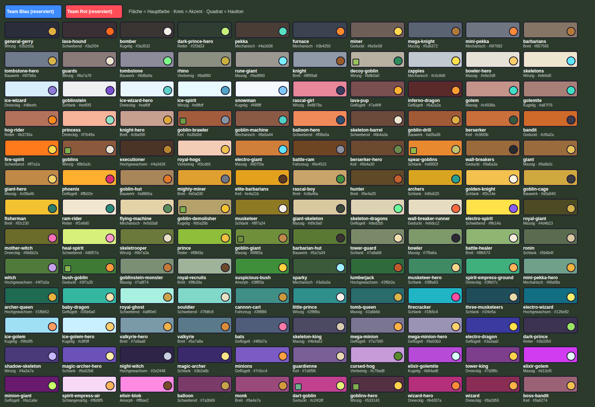

# Unterscheidbarkeits-Matrix (Phase 2 des Charakter-Neubaus)

Erzeugt von `node tools/characters/gen-docs.mjs` aus [`tools/characters/figures.mjs`](../tools/characters/figures.mjs). Regeln und Begriffe: [`CHAR_SYSTEM.md`](CHAR_SYSTEM.md). Jede Figur bekommt einen Design-Brief in [`briefs/`](briefs/).

## Prüfergebnis

| Regel | Ergebnis |
|---|---|
| Alle 130 Figuren des Rosters erfasst | ja |
| Keine zwei Zeilen mit gleicher Familie + Farbe (ΔE < 10) + Signature-Kategorie | 0 Verstöße |
| Signature-Element-Texte eindeutig | 0 Verstöße |
| Proportionsformel je Familie und Größenklasse eindeutig | 0 Verstöße |
| Idle- und Angriffsbeschreibung eindeutig | 0 Verstöße |
| Hauptfarbe nicht verwechselbar mit Blau/Rot (ΔE ≥ 15 zum Grundton, ≥ 12 zum Schattenton, ≥ 8 zum Lichtton) | 0 Verstöße |
| Gleiche Familie: ΔE Haupt ≥ 10 oder (≥ 6 und Akzent ≥ 25) | 0 Verstöße |
| Alle Paare: Farbschema ≥ 8 und nie Haupt < 6 bei Akzent < 20 | 0 Verstöße |
| Verwandte Paare (Held ↔ Basis, Golem → Golemit …): Farbschema ≥ 6 | 0 Verstöße |

Farbabstände sind CIEDE2000. Das Farbschema zweier Figuren ist √(ΔE_Haupt² + (0,6 · ΔE_Akzent)²), weil die Hauptfarbe die größere Fläche hat.

### Verteilung

| Familie | Figuren |
|---|---|
| Massig | 15 |
| Breit | 12 |
| Schlank | 12 |
| Winzig | 11 |
| Geflügelt | 11 |
| Schwebend | 9 |
| Dreieckig | 8 |
| Mechanisch | 8 |
| Kugelig | 7 |
| Hochgewachsen | 6 |
| Keil | 6 |
| Bauwerk | 6 |
| Geduckt | 6 |
| Reiter | 5 |
| Vierbeinig | 3 |
| Fahrzeug | 2 |
| Amorph | 2 |
| Schlangenartig | 1 |

Größenklassen: XS 11 · S 23 · M 47 · L 20 · XL 26 · XXL 3

### Engste Farbschemata (zur Kontrolle)

| Figur A | Figur B | Schema-ΔE | Unterschied trotz Nähe |
|---|---|---|---|
| `golem` | `golemite` | 7.5 | Familie Massig ↔ Kugelig; Größe XXL ↔ M; gewollt verwandt |
| `elixir-golem` | `elixir-golemite` | 8.0 | Familie Massig ↔ Kugelig; Größe XL ↔ M; gewollt verwandt |
| `monk` | `balloon` | 8.4 | Familie Breit ↔ Schwebend; Größe L ↔ XL |
| `goblins` | `skeleton-barrel` | 9.2 | Familie Winzig ↔ Schwebend; Größe S ↔ L |
| `giant` | `goblin-drill` | 9.3 | Familie Massig ↔ Bauwerk |
| `ice-spirit` | `snowman` | 10.0 | Familie Winzig ↔ Kugelig; Größe XS ↔ M |
| `valkyrie` | `mini-pekka` | 10.2 | Familie Breit ↔ Mechanisch |
| `wizard` | `balloon` | 10.2 | Familie Dreieckig ↔ Schwebend; Größe M ↔ XL |
| `spear-goblins` | `fire-spirit` | 10.2 | Familie Schlank ↔ Schwebend; Größe S ↔ XS |
| `archers` | `fisherman` | 10.4 | Familie Schlank ↔ Breit; Größe S ↔ M |
| `flying-machine` | `ram-rider` | 10.8 | Familie Mechanisch ↔ Reiter; Größe M ↔ L |
| `magic-archer` | `electro-dragon` | 10.8 | Familie Schlank ↔ Geflügelt |

## Matrix

Höhe = sichtbare Höhe in Feldern (Ruhepose, Fuß bis Scheitel). Teamzonen kommen zu Bodenring und Teamsymbol hinzu, die jede Figur hat.

| # | Figur | Art | Familie | Größe (Höhe) | Hauptfarbe | Akzent | Signature-Element | Kategorie | Teamzonen | Nächstes Farbschema |
|---|---|---|---|---|---|---|---|---|---|---|
| 1 | **Ritter** `knight` | Truppe | Breit | M (1,85) | `#8f99a8` mittel blau | `#9a5b2a` mittel orange | Zinnenschild in Burgturm-Form | schild | Schildfeld, Helmwimpel | `valkyrie` (18.9) |
| 2 | **Bogenschützen** `archers` | Truppe | Schlank | S (1,55) | `#d9a520` hell gelb | `#2a9d8f` mittel türkis | Fächerköcher wie ein Pfauenrad | ruecken | langer Schal, Köcherband | `fisherman` (10.4) |
| 3 | **Musketierin** `musketeer` | Truppe | Schlank | M (1,95) | `#8f7a24` mittel gelb | `#f4efe6` weißlich | Musketengabel als Stütze | werkzeug | Hutfeder, Schärpe | `skeletrooper` (13.5) |
| 4 | **Drei Musketierinnen** `three-musketeers` | Truppe | Schlank | M (1,90) | `#1f4e5a` dunkel cyan-blau | `#e7d9a8` sehr hell gelbgrün | Dreispitz mit großer Kokarde | kopfbedeckung | Kokarde, Schärpe | `electro-wizard` (13.8) |
| 5 | **Königsrekruten** `royal-recruits` | Truppe | Breit | M (1,75) | `#9fb39a` hell grün | `#6b4a2a` dunkel orange | übergroßer Schüsselhelm, der über die Augen rutscht | kopfbedeckung | Rundschild-Feld, Halstuch | `bowler` (18.2) |
| 6 | **Prinz** `prince` | Truppe | Reiter | XL (2,45) | `#8fbf3a` hell grün | `#f0c040` hell gelb | Froschmaul-Stechhelm | kopfbedeckung | Schabracke, Lanzenwimpel | `battle-healer` (16.8) |
| 7 | **Prinzessin** `princess` | Truppe | Dreieckig | S (1,60) | `#f7b49a` hell orange | `#8fe3c0` sehr hell türkis | Harfenbogen mit Saiten | waffe | Schleife am Kleid, Diadem-Stein | `golem` (12.9) |
| 8 | **Goldener Ritter** `golden-knight` | Champion | Schlank | L (2,20) | `#f2c14e` hell gelb | `#fff6e0` sehr hell gelb | Strahlenkranz-Helmzier | kopfbedeckung | Umhang, Brustemblem | `giant-hero` (20.4) |
| 9 | **Bogenschützen-Königin** `archer-queen` | Champion | Hochgewachsen | L (2,15) | `#1f6b52` mittel türkis | `#e8b33c` hell gelb | Mondsichel-Armbrust | waffe | Schleppe des Umhangs, Kronenjuwel | `tomb-queen` (11.0) |
| 10 | **Little Prince** `little-prince` | Champion | Winzig | S (1,55) | `#2f8f8a` mittel cyan-blau | `#f7f2ea` weißlich | viel zu große Krone, die über die Augen rutscht | kopfbedeckung | Umhang, Kronenkissen | `baby-dragon` (15.6) |
| 11 | **Guardienne** `guardienne` | Beschwörung | Keil | L (2,15) | `#7a5f96` mittel purpur | `#e8d9b0` sehr hell gelb | echte Holztür als Schild | schild | Türfenster-Vorhang, Schärpe | `magic-archer-hero` (11.4) |
| 12 | **König (Königsturm)** `tower-king` | Turmfigur | Dreieckig | S (1,60) | `#7d3f8c` dunkel purpur | `#ffd34d` sehr hell gelb | Zinnenkrone wie ein kleiner Turm | kopfbedeckung | Hermelinkragen-Saum, Zepterstein | `balloon` (11.7) |
| 13 | **Turmwache (Prinzessinnenturm)** `tower-guard` | Turmfigur | Schlank | S (1,35) | `#7a8a68` mittel grün | `#f0e0b0` sehr hell gelb | Signalhorn am Schulterriemen | werkzeug | Wimpel am Horn, Kappe | `skeletrooper` (10.9) |
| 14 | **Barbaren** `barbarians` | Truppe | Breit | M (1,80) | `#857565` mittel gelb | `#b57a3a` mittel orange | Wolfskopf-Kapuze mit offenem Maul | kopfbedeckung | Gürtelschärpe, Armwickel | `goblin-hut` (13.3) |
| 15 | **Elitebarbaren** `elite-barbarians` | Truppe | Keil | M (2,00) | `#e4a11b` hell gelb | `#5a3a22` dunkel orange | Bärenschädel-Schulterpanzer | schulter | Gürtelschärpe, Kriegsbemalung-Streifen am Schwertgriff | `goblin-cage` (13.2) |
| 16 | **Walküre** `valkyrie` | Truppe | Breit | M (1,95) | `#5a7a8a` mittel blau | `#d98c3a` mittel orange | Rad-Doppelaxt mit Speichen | waffe | Gürtel, Helmflügel-Spitzen | `mini-pekka` (10.2) |
| 17 | **Holzfäller** `lumberjack` | Truppe | Hochgewachsen | M (2,00) | `#2f6b3a` mittel grün | `#c25b2c` mittel orange | Holzkraxe mit Holzscheiten und Wutflasche | ruecken | Halstuch, Mützenband | `bush-goblin` (14.4) |
| 18 | **Rammbock** `battle-ram` | Truppe | Fahrzeug | M (1,70) | `#6e4523` dunkel orange | `#8a8f99` mittel grau | geschnitzter Widderkopf mit eisernen Spiralhörnern am Stamm | fahrzeug | Wimpel am Stamm, Schärpen der Schieber | `goblin-brawler` (13.9) |
| 19 | **Berserker** `berserker` | Truppe | Keil | M (1,75) | `#c96f3b` mittel orange | `#3a5a40` dunkel grün | Kochtopf-Helm mit Henkeln wie Hörner | kopfbedeckung | Schürze, Zopfbänder | `bandit` (16.1) |
| 20 | **Barbarenhütte** `barbarian-hut` | Gebäude-Spawner | Bauwerk | XL (2,90) | `#5a7a34` mittel grün | `#3a3330` schwarz | Langhaus mit Wolfsschädel über dem Tor | bauwerk | Torbehang, Dachfahne | `bowler` (14.4) |
| 21 | **Riese** `giant` | Truppe | Massig | XL (2,75) | `#9a6b3c` mittel orange | `#e8c35a` hell gelb | Bommelmütze mit Riesenbommel | kopfbedeckung | Bommel, Latzhosen-Flicken | `goblin-drill` (9.3) |
| 22 | **Königsriese** `royal-giant` | Truppe | Massig | XL (2,70) | `#4d4b23` dunkel gelbgrün | `#d4b04a` hell gelb | hohe Bärenfellmütze der Leibgarde | kopfbedeckung | Schärpe, Mützenkordel | `ronin` (15.7) |
| 23 | **Rune Giant** `rune-giant` | Truppe | Massig | XL (2,70) | `#9a9890` mittel grau | `#7af0ff` sehr hell cyan-blau | Runentafel als Schild und Waffe | werkzeug | Lendentuch, Armreif | `golemite` (19.7) |
| 24 | **Elektroriese** `electro-giant` | Truppe | Massig | XL (2,75) | `#d07f3a` mittel orange | `#5fe3ff` sehr hell cyan-blau | Teslaspulen als Schulterpolster | schulter | Gürtel, Helmstreifen | `golemite` (21.0) |
| 25 | **Bowler** `bowler` | Truppe | Massig | XL (2,60) | `#7f9a6a` mittel grün | `#2e2a33` schwarz | winziger Melonenhut auf riesigem Kopf | kopfbedeckung | Hosenträger, Hutband | `barbarian-hut` (14.4) |
| 26 | **Megaritter** `mega-knight` | Truppe | Massig | XL (2,80) | `#5a6372` mittel violett | `#b07a3a` mittel gelb | Glockenhelm, der beim Landen läutet | kopfbedeckung | Schulterumhang, Helmband | `valkyrie` (12.4) |
| 27 | **Monster** `goblinstein-monster` | Beschwörung | Massig | XL (2,75) | `#7a8f74` mittel grün | `#c47a3a` mittel orange | Rücken-Akku mit Kabeln zu Kupferklemmen am Hals | ruecken | Hosenbund, Armbinde | `goblin-giant` (13.8) |
| 28 | **Koboldriese** `goblin-giant` | Truppe | Massig | XL (2,75) | `#6f8f3a` mittel grün | `#c08a4a` mittel gelb | Fass-Krähennest mit zwei Speerkobolden | ruecken | Krähennest-Fähnchen, Gürtel | `bush-goblin` (13.8) |
| 29 | **P.E.K.K.A.** `pekka` | Truppe | Mechanisch | XL (2,85) | `#4a3d36` dunkel grau | `#58e0c0` hell türkis | Laternenkopf mit Flamme | kopfbedeckung | Brustwappen, Schulterwimpel | `bomber` (16.2) |
| 30 | **Mini-P.E.K.K.A.** `mini-pekka` | Truppe | Mechanisch | M (1,70) | `#6f7682` mittel grau | `#ff8a3d` hell orange | Dampfpfeife auf dem Kessel, pfeift beim Schlag | kopfbedeckung | Brustplakette, Pfeifenband | `valkyrie` (10.2) |
| 31 | **Funki** `sparky` | Truppe | Mechanisch | XL (2,50) | `#3a5a3a` dunkel grün | `#9ff0ff` sehr hell cyan-blau | Kondensator-Schüssel mit Ladebalken | waffe | Panzerstreifen, Antennenwimpel | `ronin` (19.8) |
| 32 | **Zappys** `zappies` | Truppe | Mechanisch | S (1,30) | `#c0c8d0` hell grau | `#ffe14a` sehr hell gelb | Glühbirnen-Kopf mit Wendelfaden | koerper | Batteriestreifen, Fußkappen | `bowler-hero` (12.7) |
| 33 | **Flugmaschine** `flying-machine` | Truppe | Mechanisch | M (1,70) | `#e5d3a8` sehr hell gelb | `#5b8c5a` mittel grün | Schlagflügel aus Segeltuch mit Holzrippen | fluegel | Flügelstreifen, Pilotenschal | `ram-rider` (10.8) |
| 34 | **Ofen** `furnace` | Truppe | Mechanisch | L (2,10) | `#3b4250` dunkel violett | `#ff8a2a` hell orange | glühende Ofenklappe als Bauch | koerper | Ofenrohr-Band, Henkeltuch | `lava-hound` (12.5) |
| 35 | **Kanonenkarre** `cannon-cart` | Truppe | Fahrzeug | M (1,70) | `#3f8f86` mittel türkis | `#c99a3c` hell gelb | Hechtkopf-Kanonenrohr | waffe | Karrenwimpel, Ohrenschützer des Kanoniers | `mini-pekka-hero` (10.9) |
| 36 | **Goblin Machine** `goblin-machine` | Truppe | Mechanisch | XL (2,55) | `#8a5a44` mittel orange | `#4fd1c5` hell türkis | Kolbenfaust mit Dampfzylinder | werkzeug | Raketenwimpel, Pilotenhelm | `golemite` (15.5) |
| 37 | **Koboldbohrer** `goblin-drill` | Gebäude-Spawner | Bauwerk | XL (2,60) | `#a05a36` mittel orange | `#e0b040` hell gelb | Bohrturm mit Schraubenspitze und Kobold-Fahrer | bauwerk | Turmfahne, Fahrerhelm | `giant` (9.3) |
| 38 | **Magier** `wizard` | Truppe | Dreieckig | M (1,95) | `#8a2d55` dunkel magenta | `#ffb347` hell gelb | fliegendes, feuerspuckendes Zauberbuch | begleiter | Gürtelschärpe, Hutband | `balloon` (10.2) |
| 39 | **Eismagier** `ice-wizard` | Truppe | Dreieckig | M (1,90) | `#d8eefc` sehr hell blau | `#8e7bd8` mittel purpur | Schneekugel-Stab mit Winterlandschaft | werkzeug | Schal, Mantelsaum | `goblinstein` (11.4) |
| 40 | **Elektromagier** `electro-wizard` | Truppe | Hochgewachsen | M (2,00) | `#126e82` mittel cyan-blau | `#f7f06d` sehr hell gelbgrün | Rucksack aus Blitzflaschen mit Kupferbügeln | ruecken | Mantelkragen, Brillenband | `tomb-queen` (12.4) |
| 41 | **Hexe** `witch` | Truppe | Hochgewachsen | L (2,10) | `#4f7a3a` mittel grün | `#c8a2e8` hell purpur | Krähe auf der Hutspitze | begleiter | Hutband, Mantelfutter | `mother-witch` (16.3) |
| 42 | **Nachthexe** `night-witch` | Truppe | Hochgewachsen | L (2,10) | `#2e2448` sehr dunkel purpur | `#c8d0e0` weißlich | Glockenturm-Hut, aus dem Fledermäuse fliegen | kopfbedeckung | Mantelfutter, Glockenseil | `shadow-skeleton` (13.6) |
| 43 | **Hexenmutter** `mother-witch` | Truppe | Dreieckig | M (1,90) | `#6b6b2a` mittel gelbgrün | `#ff6fb5` hell magenta | Kessel-Rucksack mit blubberndem Fluchsud | ruecken | Schultertuch, Hutschleife | `witch` (16.3) |
| 44 | **Magieschütze** `magic-archer` | Truppe | Schlank | M (2,00) | `#3b2a6b` dunkel purpur | `#f8e38a` sehr hell gelbgrün | Fernrohr-Bogen mit Messingvisier | waffe | Hutband, Umhangfutter | `electro-dragon` (10.8) |
| 45 | **Scharfrichter** `executioner` | Truppe | Hochgewachsen | L (2,30) | `#4a3426` dunkel orange | `#b8862d` mittel gelb | Sichelaxt an einer Kette | waffe | Schulterband, Kettenschleife | `inferno-dragon` (14.8) |
| 46 | **Goblinstein** `goblinstein` | Champion | Schlank | M (1,95) | `#eef0f2` weißlich | `#7b4fd1` mittel purpur | Fernsteuerkasten mit Blitzantenne | werkzeug | Armbinde, Brillenband | `ice-wizard` (11.4) |
| 47 | **Mönch** `monk` | Champion | Breit | L (2,15) | `#9a4a7a` mittel magenta | `#d39a3a` hell gelb | Bronzegong auf dem Rücken | ruecken | Schärpe, Gebetskette-Quaste | `balloon` (8.4) |
| 48 | **Spirit Empress (zu Fuß)** `spirit-empress-ground` | Beschwörung | Dreieckig | M (2,00) | `#3fb07c` mittel türkis | `#ffb45a` hell gelb | Laternenkrone mit schwebenden Lichtern | kopfbedeckung | Ärmelsaum, Fächerquaste | `mini-pekka-hero` (11.1) |
| 49 | **Spirit Empress (Drache)** `spirit-empress-air` | Beschwörung | Schlangenartig | XL (2,90) | `#f8d9f5` sehr hell purpur | `#ffb45a` hell gelb | Nebelband-Drache, auf dem die Kaiserin reitet | reittier | Zügelband, Ärmelsaum | `bowler-hero` (21.3) |
| 50 | **Kobolde** `goblins` | Truppe | Winzig | S (1,30) | `#8b5a3c` mittel orange | `#e9e2d0` sehr hell gelb | geschliffener Löffeldolch | waffe | Halstuch, Gürtelknoten | `skeleton-barrel` (9.2) |
| 51 | **Speerkobolde** `spear-goblins` | Truppe | Schlank | S (1,40) | `#e8892f` hell orange | `#c6c26a` hell gelbgrün | Bambusspeer-Bündel auf dem Rücken | ruecken | Hutband, Speerwimpel | `fire-spirit` (10.2) |
| 52 | **Blasrohrkobold** `dart-goblin` | Truppe | Geduckt | S (1,35) | `#c2418f` mittel magenta | `#e9f27a` sehr hell gelbgrün | Blasrohr doppelt so lang wie er selbst | waffe | Stirnband, Federschmuck | `boss-bandit` (16.8) |
| 53 | **Goblin Demolisher** `goblin-demolisher` | Truppe | Kugelig | M (1,75) | `#b5a26b` hell gelb | `#f4c430` hell gelb | Bullaugen-Helm am gepolsterten Bombenanzug | kopfbedeckung | Warnstreifen, Helmlampe | `giant-hero` (12.4) |
| 54 | **Kobold-Raufbold** `goblin-brawler` | Beschwörung | Keil | M (1,95) | `#a35d3d` mittel orange | `#8a95a3` mittel grau | gesprengte Handschellen mit Kettenresten | schmuck | Boxerhosen-Bund, Faustwickel | `battle-ram` (13.9) |
| 55 | **Busch-Kobold** `bush-goblin` | Beschwörung | Geduckt | S (1,35) | `#3f7a35` mittel grün | `#ff9a3d` hell orange | Tarnanzug aus Zweigen und Blättern | kostuem | Stirnband, Gürtel | `goblin-giant` (13.8) |
| 56 | **Lockvogel-Kobold** `decoy-goblin` | Beschwörung | Winzig | S (1,35) | `#b8b0a0` hell gelb | `#2e8a5a` mittel türkis | Lockente-Kostüm mit Holzschnabel | kostuem | Schnabelband, Halstuch | `flying-machine` (12.9) |
| 57 | **Koboldhütte** `goblin-hut` | Gebäude-Spawner | Bauwerk | XL (2,80) | `#a8865a` mittel gelb | `#e07a2a` mittel orange | schiefe Flickwerk-Hütte mit Kürbis-Schornstein | bauwerk | Türvorhang, Dachfahne | `barbarians` (13.3) |
| 58 | **Koboldkäfig** `goblin-cage` | Gebäude-Spawner | Bauwerk | L (2,20) | `#d0a840` hell gelb | `#3a3a40` dunkel grau | vergoldeter Vogelkäfig mit rüttelndem Raufbold | bauwerk | Käfigschild, Wimpel | `elite-barbarians` (13.2) |
| 59 | **Skelette** `skeletons` | Truppe | Winzig | XS (1,05) | `#efe6d0` sehr hell gelb | `#5ee6ff` sehr hell cyan-blau | riesiger rissiger Schädel mit Geisteraugen | koerper | Halstuch | `snowman` (16.3) |
| 60 | **Wächter** `guards` | Truppe | Winzig | S (1,40) | `#8a7a78` mittel grau | `#efe6d0` sehr hell gelb | Sargdeckel-Schild | schild | Sargdeckel-Emblem, Helmfeder | `miner` (16.8) |
| 61 | **Riesenskelett** `giant-skeleton` | Truppe | Massig | XL (2,90) | `#d9c9a0` hell gelb | `#3d4a3a` dunkel grün | Uhrwerk-Bombe im Brustkorb | koerper | Halstuch, Armband | `flying-machine` (15.0) |
| 62 | **Skelettkönig** `skeleton-king` | Champion | Massig | XXL (3,00) | `#4b4a62` dunkel violett | `#d8ccb0` sehr hell gelb | Geweihkrone | kopfbedeckung | Robensaum, Schulterumhang | `guardienne` (15.3) |
| 63 | **Grabkönigin** `tomb-queen` | Beschwörung | Massig | XL (2,80) | `#2a6b6b` mittel cyan-blau | `#d9b54a` hell gelb | aufrechter Sarkophag als Kleid | kostuem | Sarkophag-Band, Schleier | `archer-queen` (11.0) |
| 64 | **Skelettdrachen** `skeleton-dragons` | Truppe | Geflügelt | M (1,75) | `#ded2b5` sehr hell gelb | `#6dff9a` sehr hell grün | grünes Geisterfeuer im Brustkorb | leuchten | Halsband | `flying-machine` (18.4) |
| 65 | **Skelettfass** `skeleton-barrel` | Truppe | Schwebend | L (2,20) | `#6b4a3a` dunkel orange | `#efe6d0` sehr hell gelb | Propellerkappe auf dem Fass | kopfbedeckung | Fähnchen, Fassband | `goblins` (9.2) |
| 66 | **Mauerbrecher** `wall-breakers` | Truppe | Geduckt | S (1,45) | `#9a6a3a` mittel orange | `#2a2a2a` schwarz | Pulverfass über dem Kopf mit glimmender Lunte | werkzeug | Stirnband, Fassband | `bandit` (14.3) |
| 67 | **Läufer** `wall-breaker-runner` | Beschwörung | Geduckt | S (1,35) | `#e6dcc2` sehr hell gelb | `#ff6a3d` mittel orange-rot | flatterndes Sprinter-Stirnband | kopfbedeckung | Stirnband | `bowler-hero` (20.5) |
| 68 | **General Gerry** `general-gerry` | Beschwörung | Winzig | S (1,40) | `#2b2d3a` schwarz | `#e0b040` hell gelb | Zweispitz mit Federbusch | kopfbedeckung | Federbusch, Schärpe | `furnace` (13.3) |
| 69 | **Schattenskelett** `shadow-skeleton` | Beschwörung | Winzig | XS (1,05) | `#4a3a7a` dunkel purpur | `#c9b8ff` hell purpur | Rauchschweif statt Beine | koerper | Augenglut-Ring | `night-witch` (13.6) |
| 70 | **Skelett-Fallschirmjäger** `skeletrooper` | Beschwörung | Winzig | S (1,45) | `#6b7a3a` mittel gelbgrün | `#e9dfc5` sehr hell gelb | Fallschirm-Packsack mit Reißleine | ruecken | Fliegerschal, Packsack-Streifen | `tower-guard` (10.9) |
| 71 | **Königsgeist** `royal-ghost` | Truppe | Schwebend | M (1,95) | `#a8f0e0` sehr hell türkis | `#c9a24a` hell gelb | schwebende Krone über leerem Helm | kopfbedeckung | Umhangfetzen | `souldier` (13.9) |
| 72 | **Seelensoldat** `souldier` | Beschwörung | Schwebend | S (1,40) | `#7fd8c8` hell türkis | `#e6e0c0` sehr hell gelbgrün | Geisterpike mit Wimpelfetzen | waffe | Wimpelfetzen | `baby-dragon` (11.8) |
| 73 | **Grabstein** `tombstone` | Gebäude-Spawner | Bauwerk | M (1,90) | `#8d8a9a` mittel violett | `#7dff8a` sehr hell grün | Grabstein mit winkender Skeletthand | bauwerk | Grablicht-Schirm, Kranzschleife | `guards` (19.1) |
| 74 | **Golem** `golem` | Truppe | Massig | XXL (3,30) | `#c4938a` hell orange-rot | `#3fe0c5` hell türkis | Bäumchen mit Vogelnest auf der Schulter | begleiter | Tuch am Bäumchen, Armband | `golemite` (7.5) |
| 75 | **Golemit** `golemite` | Beschwörung | Kugelig | M (2,00) | `#a87f76` mittel orange-rot | `#3fe0c5` hell türkis | halbe Säule als Rumpf mit Kapitell-Kopf | koerper | Armband | `golem` (7.5) |
| 76 | **Elixiergolem** `elixir-golem` | Truppe | Massig | XL (2,55) | `#d13cf0` mittel purpur | `#e6f7ff` weißlich | Glasbauch voller blubbernder Flüssigkeit | koerper | Halsband, Korkensiegel | `elixir-golemite` (8.0) |
| 77 | **Elixiergolemit** `elixir-golemite` | Beschwörung | Kugelig | M (1,90) | `#b84ad8` mittel purpur | `#d8fff7` sehr hell türkis | Erlenmeyerkolben-Körper mit Stopfen | koerper | Halsband | `elixir-golem` (8.0) |
| 78 | **Elixierklecks** `elixir-blob` | Beschwörung | Amorph | XS (1,20) | `#ff8ae2` hell magenta | `#7a4a2a` dunkel orange | Korkhütchen auf dem Klecks | kopfbedeckung | Hutband | `rascal-girl` (24.2) |
| 79 | **Eisgolem** `ice-golem` | Truppe | Kugelig | M (1,95) | `#9fe0f5` sehr hell cyan-blau | `#ff9a62` hell orange | eingefrorener Fisch im Bauch | koerper | Strickschal | `ice-golem-hero` (14.2) |
| 80 | **Lavahund** `lava-hound` | Truppe | Schwebend | XXL (3,00) | `#3a2f34` schwarz | `#ff6a1a` mittel orange | Vulkankrater auf dem Rücken | koerper | Halsband | `furnace` (12.5) |
| 81 | **Lavawelpe** `lava-pup` | Beschwörung | Geflügelt | XS (1,15) | `#7a4f4f` dunkel orange-rot | `#ffb02e` hell gelb | Glutkringel-Schwanz | koerper | Halsband | `boss-bandit` (12.4) |
| 82 | **Feuergeist** `fire-spirit` | Truppe | Schwebend | XS (1,00) | `#ff7a1a` hell orange | `#ffd84d` sehr hell gelb | Kerzenwachs-Körper mit Flammenhaar | koerper | Wachsmanschette | `spear-goblins` (10.2) |
| 83 | **Eisgeist** `ice-spirit` | Truppe | Winzig | XS (0,95) | `#e8fbff` weißlich | `#4fa3c7` mittel blau | Eiskristall-Stacheln wie ein Igel | koerper | Schleife | `snowman` (10.0) |
| 84 | **Elektrogeist** `electro-spirit` | Truppe | Schwebend | XS (1,00) | `#ffe14a` sehr hell gelb | `#8d5cf6` mittel purpur | Steckerzinken als Ohren | koerper | Schwanzband | `mighty-miner` (21.7) |
| 85 | **Heilungsgeist** `heal-spirit` | Truppe | Schwebend | XS (1,00) | `#d6f07a` sehr hell gelbgrün | `#ff9ac8` hell magenta | Pusteblumen-Kopf | koerper | Blattschleife | `electro-spirit` (23.2) |
| 86 | **Schneemann** `snowman` | Beschwörung | Kugelig | M (2,00) | `#f4f8ff` weißlich | `#7fc8ff` hell blau | Frostkrone aus Eiszapfen | kopfbedeckung | Strickschal | `ice-spirit` (10.0) |
| 87 | **Drachenbaby** `baby-dragon` | Truppe | Geflügelt | M (1,75) | `#35b6a0` hell türkis | `#ffe3b0` sehr hell gelb | Eierschalen-Mütze | kopfbedeckung | Lätzchen | `souldier` (11.8) |
| 88 | **Elektrodrache** `electro-dragon` | Truppe | Geflügelt | M (2,00) | `#3a3aa0` dunkel purpur | `#ffe14a` sehr hell gelb | Blitzableiter-Horn mit Kupferspule | koerper | Flügelsaum | `magic-archer` (10.8) |
| 89 | **Infernodrache** `inferno-dragon` | Truppe | Geflügelt | L (2,15) | `#5a2a2a` dunkel orange-rot | `#ff9d2e` hell orange | Brennglas in Messingfassung vor dem Maul | werkzeug | Halfterriemen | `lava-pup` (12.6) |
| 90 | **Phönix** `phoenix` | Truppe | Geflügelt | M (1,90) | `#ffb02e` hell gelb | `#e0306f` mittel rosa-rot | Schleppfedern wie Flammenbänder | koerper | Fußring | `mighty-miner` (19.5) |
| 91 | **Fledermäuse** `bats` | Truppe | Geflügelt | XS (0,95) | `#4f5d7a` dunkel violett | `#ff7aa8` hell magenta | Lindenblatt-Ohren und ein einzelner Zahn | koerper | Flügelspitzen-Bänder | `shadow-skeleton` (20.2) |
| 92 | **Lakaien** `minions` | Truppe | Geflügelt | S (1,30) | `#7c5cc4` mittel purpur | `#ff9f43` hell orange | einzelnes Stirnhorn und Pik-Schwanz | koerper | Halstuch | `valkyrie` (14.4) |
| 93 | **Megalakai** `mega-minion` | Truppe | Geflügelt | M (1,85) | `#7a7590` mittel violett | `#ffb347` hell gelb | Steinbauch-Panzer mit Wasserspeier-Hörnern | koerper | Armbinde | `tombstone-hero` (12.4) |
| 94 | **Minion Giant** `minion-giant` | Truppe | Geflügelt | XL (2,60) | `#6a1a6e` dunkel purpur | `#c8ff6b` sehr hell grün | Kehlsack, der sich vor dem Spucken aufbläht | koerper | Ohrmarke, Armbinde | `magic-archer` (15.4) |
| 95 | **Königsschweinchen** `royal-hogs` | Truppe | Vierbeinig | XS (1,15) | `#f3cdb5` sehr hell orange | `#f2c14e` hell gelb | Minikrone zwischen den Ohren | kopfbedeckung | Schleife am Ringelschwanz | `knight-hero` (12.6) |
| 96 | **Fluch-Schwein** `cursed-hog` | Beschwörung | Vierbeinig | XS (1,25) | `#c79ad8` hell purpur | `#5b8a2a` mittel grün | Mini-Hexenhut mit Fluchsternchen | kopfbedeckung | Hutband | `mega-minion-hero` (24.0) |
| 97 | **Nashorn** `rhino` | Beschwörung | Vierbeinig | M (2,00) | `#8a8f80` mittel grau | `#c9b13f` hell gelb | Doppelhorn mit Sichelmond-Schutzplatte | koerper | Satteldecke | `tower-guard` (13.0) |
| 98 | **Schweinereiter** `hog-rider` | Truppe | Reiter | L (2,15) | `#b3735a` mittel orange | `#ff8c1a` hell orange | Karottenangel vor der Schweineschnauze | reittier | Rennseide-Rauten, Satteldecke | `goblin-hut` (13.7) |
| 99 | **Dunkler Prinz** `dark-prince` | Truppe | Reiter | L (2,35) | `#3b3350` dunkel purpur | `#9be564` sehr hell grün | gepanzerter Waran als Reittier | reittier | Schabracke, Schildmitte | `magic-archer` (15.3) |
| 100 | **Widderreiterin** `ram-rider` | Truppe | Reiter | L (2,30) | `#f1e6d0` sehr hell gelb | `#2b8c7a` mittel türkis | Widder mit Doppelspiral-Hörnern und Glöckchen | reittier | Satteldecke, Zopfbänder | `flying-machine` (10.8) |
| 101 | **Banditin** `bandit` | Truppe | Geduckt | M (1,70) | `#cf6a2a` mittel orange | `#3c3a4a` dunkel violett | Fuchsohr-Kapuze mit Fuchsschwanz-Schal | kostuem | Schalknoten, Gürtel | `balloon-hero` (13.6) |
| 102 | **Boss Bandit** `boss-bandit` | Champion | Keil | M (2,00) | `#9a6274` mittel magenta | `#f2c14e` hell gelb | Beutesack über der Schulter, aus dem Münzen fallen | ruecken | Mantelfutter, Halstuch | `monk` (11.5) |
| 103 | **Fischer** `fisherman` | Truppe | Breit | M (1,90) | `#f2c230` hell gelb | `#2e7d6b` mittel türkis | Angelrute mit Riesen-Blinker | werkzeug | Halstuch, Hutband | `archers` (10.4) |
| 104 | **Jäger** `hunter` | Truppe | Breit | M (1,90) | `#5e4a26` dunkel gelb | `#c4602d` mittel orange | Donnerbüchse mit Trichtermündung | waffe | Patronengurt-Schärpe, Mützenschwanz-Band | `executioner` (16.1) |
| 105 | **Tunnelgräber** `miner` | Truppe | Geduckt | M (1,70) | `#6e5e58` mittel grau | `#ffd84d` sehr hell gelb | Maulwurf-Schaufelkrallen | koerper | Halstuch | `lava-pup` (13.6) |
| 106 | **Großer Gräber** `mighty-miner` | Champion | Breit | L (2,35) | `#e0a030` hell gelb | `#6f7682` mittel grau | Bohrer statt rechtem Arm | werkzeug | Helmband, Gürtel | `goblin-cage` (14.3) |
| 107 | **Ronin** `ronin` | Truppe | Schlank | M (2,00) | `#5b6b4f` mittel grün | `#d9c8a0` hell gelb | tiefer Strohhut mit Papiersiegel | kopfbedeckung | Hüftschärpe, Siegelband | `skeletrooper` (11.5) |
| 108 | **Feuerwerkerin** `firecracker` | Truppe | Schlank | S (1,60) | `#1fb5c4` hell cyan-blau | `#ff4fa3` mittel magenta | Papierschirm, dessen Speichen Raketen sind | waffe | Schirmrand, Gürtelschleife | `ice-golem` (26.3) |
| 109 | **Kampfheilerin** `battle-healer` | Truppe | Breit | M (1,85) | `#8fb573` hell grün | `#f4ecd8` sehr hell gelb | Mörser-Rucksack mit Kräutern | ruecken | Kopftuch, Schürzenband | `tower-guard` (15.3) |
| 110 | **Bomber** `bomber` | Truppe | Kugelig | S (1,45) | `#3a3532` dunkel grau | `#f2efe6` weißlich | Zylinder voller Bomben | kopfbedeckung | Halstuch, Hutband | `skeleton-barrel` (15.7) |
| 111 | **Ballon** `balloon` | Truppe | Schwebend | XL (2,60) | `#7a3b69` dunkel magenta | `#c9a24a` hell gelb | Zwiebelkuppel-Ballon aus Flicken mit Messingpropeller | koerper | Wimpelkette, Korbrand | `monk` (8.4) |
| 112 | **Rabauke** `rascal-boy` | Beschwörung | Breit | M (1,95) | `#c8a46a` hell gelb | `#3f8f3f` mittel grün | Rüstung aus Pappkartons mit Klebeband | kostuem | Kappe, Klebeband-Streifen | `flying-machine` (13.6) |
| 113 | **Rabaukin** `rascal-girl` | Beschwörung | Winzig | S (1,50) | `#e8879a` hell rosa-rot | `#3a3d5c` dunkel violett | Astgabel-Schleuder | waffe | Haarschleifen, Latzhosen-Träger | `balloon-hero` (22.6) |
| 114 | **Suspicious Bush** `suspicious-bush` | Truppe | Amorph | S (1,35) | `#3f8f3a` mittel grün | `#ffd23f` sehr hell gelb | zwei Augenpaare im Busch und große Schuhe | koerper | Schnürsenkel | `musketeer-hero` (11.5) |
| 115 | **Ritter (Held)** `knight-hero` | Held von `knight` | Breit | M (1,95) | `#c8a090` hell orange | `#e0a83a` hell gelb | Löwenmähnen-Kragen mit Heldenumhang | umhang | Umhang, Schildfeld | `royal-hogs` (12.6) |
| 116 | **Riese (Held)** `giant-hero` | Held von `giant` | Massig | XL (2,90) | `#c08a46` mittel gelb | `#f3d36b` sehr hell gelb | Erntekrone aus Weizenähren | kopfbedeckung | Steppdecken-Umhang, Bommel | `spear-goblins` (10.9) |
| 117 | **Mini-P.E.K.K.A. (Held)** `mini-pekka-hero` | Held von `mini-pekka` | Mechanisch | M (1,80) | `#6fa08a` mittel türkis | `#f0b23a` hell gelb | Pfannkuchen-Turm auf dem Rücken mit Sirupflasche | ruecken | Brustplakette, Serviette | `cannon-cart` (10.9) |
| 118 | **Musketierin (Held)** `musketeer-hero` | Held von `musketeer` | Schlank | L (2,05) | `#3f8a63` mittel türkis | `#f2d58a` sehr hell gelb | Werkzeuggürtel mit Kurbel und Bauplan-Rolle | werkzeug | Hutfeder, Schärpe | `suspicious-bush` (11.5) |
| 119 | **Eisgolem (Held)** `ice-golem-hero` | Held von `ice-golem` | Kugelig | L (2,05) | `#c8f0ff` sehr hell cyan-blau | `#ffcf6b` sehr hell gelb | Eiskrone mit Schneeflocken-Zacken | kopfbedeckung | Frostschärpe, Strickschal | `zappies` (13.5) |
| 120 | **Magier (Held)** `wizard-hero` | Held von `wizard` | Dreieckig | L (2,05) | `#b4307a` mittel magenta | `#ff8a3a` hell orange | Flammenumhang, der sich zu Flügeln öffnet | umhang | Gürtelschärpe, Hutband | `monk` (11.0) |
| 121 | **Kobolde (Held)** `goblins-hero` | Held von `goblins` | Winzig | S (1,40) | `#533143` dunkel magenta | `#ffd34d` sehr hell gelb | Brigade-Banner auf dem Rücken | fahne | Bannertuch, Halstuch | `balloon` (13.9) |
| 122 | **Megalakai (Held)** `mega-minion-hero` | Held von `mega-minion` | Geflügelt | M (1,95) | `#9a93b3` mittel purpur | `#ffd36b` sehr hell gelb | Visierhelm mit Heldenstern | kopfbedeckung | Armbinde, Helmbusch | `mega-minion` (12.8) |
| 123 | **Magieschütze (Held)** `magic-archer-hero` | Held von `magic-archer` | Schlank | L (2,10) | `#6a52b8` mittel purpur | `#fff0a8` sehr hell gelbgrün | Sternbild-Mantel mit drei leuchtenden Pfeilsternen | umhang | Hutband, Umhangfutter | `guardienne` (11.4) |
| 124 | **Ballon (Held)** `balloon-hero` | Held von `balloon` | Schwebend | XL (2,75) | `#f08a5a` hell orange | `#2f4f6f` dunkel blau | Skelett-Kadett mit Fallschirm im Korb | begleiter | Wimpelkette, Korbrand | `bandit` (13.6) |
| 125 | **Bowler (Held)** `bowler-hero` | Held von `bowler` | Massig | XL (2,75) | `#e6e2d8` weißlich | `#ffcf6b` sehr hell gelb | Krone aus Kegeln | kopfbedeckung | Hosenträger, Kegelband | `zappies` (12.7) |
| 126 | **Dunkler Prinz (Held)** `dark-prince-hero` | Held von `dark-prince` | Reiter | XL (2,50) | `#2f3d33` dunkel grün | `#c6f07a` sehr hell grün | Sichelmond-Krone über dem Visier | kopfbedeckung | Schabracke, Schildmitte | `three-musketeers` (16.9) |
| 127 | **Berserker (Held)** `berserker-hero` | Held von `berserker` | Keil | M (1,85) | `#6b4a30` dunkel orange | `#6b8a4a` mittel grün | Bärenfell-Umhang mit Bärenkopf-Kapuze | umhang | Schürze, Zopfbänder | `battle-ram` (17.1) |
| 128 | **Walküre (Held)** `valkyrie-hero` | Held von `valkyrie` | Breit | L (2,05) | `#7a9aa8` mittel blau | `#f0b24a` hell gelb | Sturmflügelhelm mit goldenen Schwingen | kopfbedeckung | Gürtel, Windbänder | `tombstone-hero` (13.0) |
| 129 | **Eismagier (Held)** `ice-wizard-hero` | Held von `ice-wizard` | Dreieckig | M (2,00) | `#eaf6ff` weißlich | `#5fd0c8` hell türkis | kleiner Schneemann-Gehilfe auf der Schulter | begleiter | Schal, Mantelsaum | `ice-spirit` (12.8) |
| 130 | **Grabstein (Held)** `tombstone-hero` | Gebäude-Spawner von `tombstone` | Bauwerk | XL (2,50) | `#6f7b8a` mittel blau | `#d9b54a` hell gelb | Mausoleum mit Säulen und Krone über dem Tor | bauwerk | Torbanner, Kranzschleife | `valkyrie` (12.0) |

## Proportion, Ausdruck und Bewegung

Proportionsformel: K = Kopfhöhe / Gesamthöhe, B = Beinlänge / Gesamthöhe, A = Armlänge / Rumpfhöhe, H = Handbreite / Kopfbreite, W = Länge von Waffe, Werkzeug oder Signature / Gesamthöhe.

| Figur | K · B · A · H · W | Übertriebenes Merkmal | Persönlichkeit | Idle | Angriff |
|---|---|---|---|---|---|
| `knight` | 0,36 · 0,22 · 0,85 · 0,50 · 0,75 | Zinnenschild fast so hoch wie er selbst | stur und pflichtbewusst, Pflaster quer über der Nase | klopft mit dem Schwertknauf zweimal an den Schild und späht über die Zinnen | Schild vor, kurzer Hieb von oben hinter dem Schild hervor |
| `archers` | 0,38 · 0,30 · 0,90 · 0,42 · 0,55 | Pfeilfächer breiter als die Schultern | sportlich und eifrig, zwinkern beim Zielen | wippen auf den Zehen und zupfen an der Sehne | Pfeil aus dem Fächer, weites Spannen, Schuss mit Schwung nach hinten |
| `musketeer` | 0,32 · 0,36 · 0,90 · 0,40 · 1,00 | Muskete länger als sie selbst | ruhig und präzise, hebt eine Augenbraue | stellt die Gabel ab, pustet über die Mündung | Gabel aufstellen, zielen, Schuss mit Rauchring und Rückstoß |
| `three-musketeers` | 0,33 · 0,34 · 0,90 · 0,42 · 0,70 | riesige Kokarden am Dreispitz | eingespielt und keck, Schwestern-Grinsen | drehen den Karabiner wie einen Taktstock | Karabiner-Schuss; aus der Nähe Bajonett-Stoß |
| `royal-recruits` | 0,42 · 0,22 · 0,80 · 0,45 · 0,90 | Helm so groß wie der Oberkörper | jung, nervös und tapfer | schieben den Helm hoch, der wieder herunterrutscht | Pikenstoß über den Schildrand |
| `prince` | 0,24 · 0,00 · 0,80 · 0,40 · 1,15 | Turnierlanze mit Spiralstreifen | edel und ungeduldig | Pferd scharrt, Prinz richtet die Lanze aus | Lanzenstoß im Vorbeireiten; Ansturm mit gesenkter Lanze |
| `princess` | 0,36 · 0,00 · 0,85 · 0,38 · 0,65 | Glockenkleid fast so breit wie hoch | verträumt, summt beim Zielen | zupft eine Saite und lauscht | zieht eine glühende Saite wie eine Sehne, brennender Pfeil im hohen Bogen |
| `golden-knight` | 0,30 · 0,38 · 0,90 · 0,40 · 0,75 | Strahlenkranz wie eine Sonne hinter dem Kopf | eitel und strahlend, posiert | poliert die Klinge und pustet eine Haarsträhne weg | Fechter-Ausfall mit dem Rapier |
| `archer-queen` | 0,27 · 0,42 · 0,95 · 0,38 · 0,80 | steife Spitzenkrause bis über die Ohren | kühl und überlegen, hochgezogene Augenbraue | prüft die Sehne, der Umhang weht | legt an, kurzes Zielen, Schuss mit Rückstoß |
| `little-prince` | 0,46 · 0,22 · 0,75 · 0,42 · 0,55 | Krone so breit wie der ganze Prinz | verwöhnt und ungeduldig, stampft | schiebt die Krone hoch und verschränkt die Arme | kurbelt die Repetier-Armbrust, die immer schneller schießt |
| `guardienne` | 0,28 · 0,36 · 0,95 · 0,50 · 1,00 | Tür-Schild mit Klinke und Briefschlitz | wachsam, beschützend, wortkarg | stellt die Tür ab und lehnt sich daran | Hellebardenstoß hinter der Tür hervor; Ansturm mit der Tür voran |
| `tower-king` | 0,40 · 0,00 · 0,70 · 0,45 · 0,60 | runder Königsbauch im Hermelinmantel | gemütlich und stolz, im Schlaf mit Zipfelmütze | schläft mit Zipfelmütze über der Krone; wach: zeigt mit dem Zepter | zeigt mit dem Zepter auf das Ziel, die Turmkanone feuert |
| `tower-guard` | 0,40 · 0,28 · 0,85 · 0,40 · 0,60 | langer Turmbogen | aufmerksam, streng | späht unter der Hand hervor, bläst kurz ins Horn | schneller Schuss mit dem Turmbogen |
| `barbarians` | 0,34 · 0,22 · 0,90 · 0,55 · 0,60 | gewaltige umwickelte Unterarme | laut und draufgängerisch, brüllt | rollt die Schultern und klopft sich auf die Brust | weit ausholender Hackschwert-Hieb über den Kopf bis zum Boden |
| `elite-barbarians` | 0,28 · 0,30 · 1,00 · 0,50 · 0,85 | Schultern doppelt so breit wie die Hüfte | angeberisch, grinst überlegen | Wellenschwert lässig auf der Schulter, dehnt den Nacken | zweihändiger Diagonalhieb mit halber Drehung |
| `valkyrie` | 0,32 · 0,28 · 0,90 · 0,50 · 0,70 | Axt mit Radnabe, so breit wie sie | kampflustig, lacht beim Wirbeln | stützt die Axt auf und wirft einen Zopf zurück | Anlauf-Drehung: ganzer Körper wirbelt mit der Axt einmal herum |
| `lumberjack` | 0,27 · 0,41 · 1,05 · 0,50 · 0,80 | Bart voller Tannenzweige | hektisch und gutgelaunt | wirft die Fällaxt hoch und fängt sie | blitzschnelle Hiebe wie beim Holzhacken |
| `battle-ram` | 0,30 · 0,20 · 0,90 · 0,50 · 1,40 | riesige eiserne Spiralhörner | zwei schnaufende Schieber, entschlossen | Schieber stampfen auf der Stelle, Stamm wippt | Anlauf, Rammstoß mit Squash des Stammes, Splitterwolke |
| `berserker` | 0,34 · 0,30 · 0,95 · 0,50 · 0,50 | zwei riesige Bratpfannen | wild, lacht gackernd | schlägt die Pfannen gegeneinander, Funken | abwechselnde Pfannenschläge links und rechts, sehr schnell |
| `barbarian-hut` | – | tief heruntergezogenes Grassodendach | rauchend und lärmend | Rauch aus dem Dachloch, Torbehang weht | Tor fliegt auf, Barbaren stürmen heraus |
| `giant` | 0,20 · 0,20 · 1,10 · 0,75 · 0,20 | riesige Arbeitshandschuhe | gutmütig und schnaufend | kratzt sich unter der Mütze | beide Fäuste gefaltet, Hammerschlag von oben |
| `royal-giant` | 0,24 · 0,22 · 1,00 · 0,65 · 0,50 | Schulterkanone mit Löwenmaul-Mündung | streng und stolz, Schnurrbart zuckt | salutiert und putzt einen Messingknopf | Kanone auf der Schulter: Zielen, Abfeuern, Rückstoß bis in die Knie |
| `rune-giant` | 0,22 · 0,24 · 1,05 · 0,60 · 0,55 | leuchtende Runen-Tätowierungen | feierlich und weise, murmelt | meißelt eine neue Rune in die Tafel | Tafel-Stoß von oben; beim Verzaubern leuchtet eine Rune auf |
| `electro-giant` | 0,22 · 0,22 · 1,05 · 0,70 · 0,30 | riesige Gummihandschuhe | grimmig, knurrt durch das Schweißervisier | Funken springen zwischen den Spulen | Faustschlag von oben mit Entladung; Gegenschlag lässt die Spulen aufblitzen |
| `bowler` | 0,26 · 0,24 · 1,05 · 0,65 · 0,35 | Moos-Rücken eines Steintrolls | gemütlich, konzentriert wie beim Kegeln | poliert die Runenkugel am Bauch | tiefer Kegelwurf: weit ausholen, rollen lassen, Bein hoch |
| `mega-knight` | 0,24 · 0,20 · 1,00 · 0,80 · 0,00 | Kugelfäuste aus Gusseisen | wuchtig und selbstgefällig | lässt die Kugelfäuste aneinanderklacken | Doppelfaust-Hammer; Sprung mit Glockenläuten bei der Landung |
| `goblinstein-monster` | 0,20 · 0,24 · 1,10 · 0,70 · 0,20 | Flickenkörper mit ungleich großen Armen | sanftes Monster, brummt Wiegenlieder | Funken an den Klemmen, wiegt den Kopf | schwerfälliger Doppelschlag; Blitzverbindung zum Doktor |
| `goblin-giant` | 0,22 · 0,20 · 1,10 · 0,70 · 0,45 | Riesenohren mit Ohrringen wie Fassreifen | tumb und gutmütig, grinst schief | die beiden Speerkobolde zanken sich im Fass | schwerer Schwinger mit der Faust; oben werfen die Speerkobolde |
| `pekka` | 0,20 · 0,30 · 1,00 · 0,55 · 0,90 | Fallbeil-Schwert länger als der Rumpf | stumm und unaufhaltsam, die Flamme flackert vor Zorn | Flamme flackert, Kolben zischen leise | Schwert weit über den Kopf, Fallbeil-Hieb mit Funken |
| `mini-pekka` | 0,50 · 0,22 · 0,80 · 0,50 · 0,70 | Riesen-Rohrzange | eifrig und tollpatschig, ein großes Zyklopenauge | tippelt, Dampfwölkchen aus der Pfeife | Rohrzange über den Kopf, Schlag, Pfiff |
| `sparky` | 0,20 · 0,15 · 0,60 · 0,50 · 0,60 | Schüssel größer als der Käferpanzer | brummt ungeduldig, Ladebalken als Gesichtsausdruck | Ladebalken füllen sich, Beine trippeln | volle Ladung: Schüssel glüht, gewaltiger Entladungsschuss, Rückstoß |
| `zappies` | 0,45 · 0,25 · 0,70 · 0,45 · 0,30 | Batterie-Rucksack größer als der Rumpf | aufgekratzt, flackern beim Reden | Birne flackert, Federbeine wippen | Birne leuchtet auf, Zap-Blitz aus der Antenne |
| `flying-machine` | 0,20 · 0,00 · 0,60 · 0,40 · 1,30 | Flügelspannweite doppelt so groß wie die Höhe | Pilotin mit Zunge im Mundwinkel | Flügel schlagen, Pilotin kurbelt | Bugkanone feuert, Gestell ruckt zurück |
| `furnace` | 0,30 · 0,20 · 0,60 · 0,45 · 0,40 | Ofenrohr als hoher Hut | brummig und hitzköpfig | pafft Rauchringe aus dem Ofenrohr | Klappe schnappt auf, spuckt Glut; Feuergeist hüpft heraus |
| `cannon-cart` | 0,28 · 0,00 · 0,70 · 0,45 · 0,90 | Fischmaul-Mündung mit Zähnen | Kanonier mit Ohrenschützern, pfeift | Kanonier schaut durchs Fernrohr | Rohr ruckt zurück, Rauch aus dem Fischmaul |
| `goblin-machine` | 0,20 · 0,25 · 1,00 · 0,80 · 0,40 | Kolbenfaust größer als der Pilot | Pilot jauchzt, Maschine stampft | Auspuff pufft, Pilot kurbelt an den Hebeln | Kolbenfaust schnellt vor; Schulter-Raketenwerfer feuert unabhängig |
| `goblin-drill` | – | Riesenschraube | rattert und ruckelt | Schraube dreht, Erdbrocken fliegen | Luke springt auf, Kobold hüpft heraus |
| `wizard` | 0,30 · 0,00 · 0,85 · 0,45 · 0,35 | Ballonärmel | theatralisch, deklamiert | blättert im schwebenden Buch, das gähnt | Buch schnappt auf, spuckt einen Feuerball; Magier dirigiert |
| `ice-wizard` | 0,32 · 0,00 · 0,80 · 0,45 · 0,85 | Eiszapfen-Bart bis zum Gürtel | gelassen und schusselig | schüttelt die Schneekugel und staunt | schwenkt die Schneekugel, Eissplitter-Fächer |
| `electro-wizard` | 0,28 · 0,40 · 1,00 · 0,50 · 0,45 | Kupferspulen-Handschuhe | exzentrisch, grinst manisch | Funken knistern zwischen den Fingern | beide Hände vor, zwei Blitze gleichzeitig |
| `witch` | 0,26 · 0,42 · 1,00 · 0,40 · 0,90 | krummer, zweimal geknickter Hut | gackernd und verschlagen | Krähe putzt sich, Knochen-Windspiel klimpert | Stab nach vorn, Knochenspiel klingt, Geisterkugel fliegt |
| `night-witch` | 0,24 · 0,42 · 1,00 · 0,40 · 0,80 | Hut mit kleinem Glockenstuhl | träge und spöttisch, gähnt | die Glocke im Hut schwingt, eine Fledermaus guckt heraus | Sichelstab-Hieb; beim Rufen läutet die Hutglocke |
| `mother-witch` | 0,32 · 0,00 · 0,85 · 0,45 · 0,45 | Lockenwickler unter dem Hut | resolute Hexen-Oma, droht mit der Kelle | rührt im Rückenkessel, schnuppert | schleudert Fluchsud mit der Kelle |
| `magic-archer` | 0,30 · 0,38 · 0,95 · 0,40 · 0,90 | Astrolabium-Hutkrempe mit Messingringen | verträumter Sterngucker, präzise | schaut durch das Fernrohr in den Himmel | zielt durch das Fernrohr, Lichtpfeil schießt in gerader Linie |
| `executioner` | 0,22 · 0,44 · 1,05 · 0,50 · 0,60 | Eisenmaske mit zwei runden Gucklöchern | stoisch, summt unheimlich | lässt die Axt an der Kette pendeln | Drehung, die Axt fliegt im weiten Bogen aus und kommt zurück in die Hand |
| `goblinstein` | 0,34 · 0,34 · 0,90 · 0,45 · 0,55 | Schweißerbrille mit dicken Gläsern | größenwahnsinnig, lacht irre | drückt Knöpfe am Kasten, Antenne funkt | reckt die Antenne, Blitz auf das Ziel |
| `monk` | 0,30 · 0,26 · 0,95 · 0,60 · 0,55 | riesige Handflächen | heiter und unerschütterlich | streicht sich den Bart, Gebetskette klackert | Kombo aus Handflächenstößen, der dritte mit Gongschlag |
| `spirit-empress-ground` | 0,28 · 0,00 · 0,95 · 0,40 · 0,50 | bodenlange Seidenärmel | würdevoll, lächelt geheimnisvoll | fächelt mit dem Seidenfächer, Lichter kreisen | Fächerschlag mit Geisterwelle |
| `spirit-empress-air` | 0,20 · 0,00 · 0,80 · 0,40 · 1,60 | Drachenleib als endloses Nebelband | schwebend und erhaben | Drachenleib wogt in Wellen | Drache stößt eine Geisterwelle aus |
| `goblins` | 0,48 · 0,22 · 0,80 · 0,45 · 0,35 | Riesenohren mit Goldringen | frech und gierig | hüpfen und lecken am Löffel | schnelles Zustechen mit dem Löffeldolch |
| `spear-goblins` | 0,44 · 0,26 · 0,85 · 0,42 · 0,75 | Anglerhut mit Haken an der Krempe | eifrig, streckt die Zunge raus | zählen ihre Speere | weit ausholender Speerwurf mit Hüpfer |
| `dart-goblin` | 0,44 · 0,24 · 0,80 · 0,40 · 1,40 | Blasrohr | hibbelig, schielt beim Zielen | pustet Staub aus dem Blasrohr | Backen aufblasen, Pfeil, Backen fallen zusammen |
| `goblin-demolisher` | 0,36 · 0,18 · 0,75 · 0,55 · 0,30 | kugelrunder Polsteranzug | fröhlich-leichtsinnig | klopft an die Helmscheibe | Dynamitstange über Kopf werfen; Ansturm-Form mit brennender Helmlunte |
| `goblin-brawler` | 0,30 · 0,24 · 1,10 · 0,75 · 0,30 | Fäuste groß wie der Kopf | wütend und befreit, schnaubt | schattenboxt, Ketten klirren | Haken-Kombination mit den Kettenfäusten |
| `bush-goblin` | 0,44 · 0,22 · 0,80 · 0,45 · 0,35 | Blätterschopf wie ein Strauch | verschwörerisch, flüstert | schaut sich verstohlen um | Sprung aus der Hocke mit Stichdolch |
| `decoy-goblin` | 0,46 · 0,20 · 0,75 · 0,42 · 0,30 | Entenschnabel-Kapuze | albern, quakt | watschelt auf der Stelle | Schnabel-Kopfstoß und Stich |
| `goblin-hut` | – | krummer Kürbisschornstein | knarzend, Kobolde gucken heraus | Schornstein raucht, Vorhang wackelt | Vorhang fliegt auf, ein Speerkobold springt heraus |
| `goblin-cage` | – | riesiges Vorhängeschloss | wackelnd, der Gefangene tobt | Raufbold rüttelt an den Stäben | Käfig platzt, Raufbold stürmt heraus; Evo: Stäbe ziehen Gegner hinein |
| `skeletons` | 0,52 · 0,20 · 0,75 · 0,45 · 0,35 | Schädel halb so groß wie der ganze Körper | klapprig-fröhlich | Kiefer klappert, Kopf wackelt | Stich mit dem Knochendolch |
| `guards` | 0,42 · 0,22 · 0,80 · 0,42 · 0,85 | Sargdeckel länger als der Wächter | steif und pflichtbewusst, salutieren | stehen stramm, ein Knochen wackelt | Speerstoß hinter dem Sargdeckel hervor |
| `giant-skeleton` | 0,24 · 0,30 · 1,10 · 0,70 · 0,30 | Riesenfäuste aus Fingerknochen | dröhnend lachend | Kiefer klappert, die Bombe tickt | Rundumschlag mit der Knochenfaust |
| `skeleton-king` | 0,24 · 0,30 · 1,05 · 0,60 · 0,65 | Grabstein-Keule | majestätisch und hohl lachend | stützt sich auf die Grabstein-Keule, Seelenlichter kreisen | Grabstein-Keule von oben, Flächenschlag |
| `tomb-queen` | 0,22 · 0,00 · 1,00 · 0,50 · 0,50 | Sarkophag-Rumpf mit bemalter Maske | eisig und erhaben | Sarkophagdeckel öffnet sich einen Spalt | Schlag mit dem Zepter, Deckel klappt auf |
| `skeleton-dragons` | 0,30 · 0,00 · 0,00 · 0,00 · 1,20 | Knochenflügel mit zerfetzter Haut | gierig, schnappt | Flügelschlag, Feuer züngelt durch die Rippen | grüner Feuerball aus dem Kiefer |
| `skeleton-barrel` | 0,00 · 0,00 · 0,00 · 0,00 · 0,30 | Knochen gucken aus den Spundlöchern | ratternd und kichernd | Propeller dreht, Fass schaukelt | Sturz auf das Gebäude, Fass platzt |
| `wall-breakers` | 0,40 · 0,26 · 0,80 · 0,45 · 0,45 | Fass größer als der Träger | begeistert, rennt kichernd | balanciert das Fass | Sprung gegen das Gebäude, Fass zündet |
| `wall-breaker-runner` | 0,42 · 0,30 · 0,85 · 0,45 · 0,20 | extrem lange Knochenbeine | gehetzt, rudert mit den Armen | trippelt auf der Stelle | Hechtsprung mit Faustschlag |
| `general-gerry` | 0,46 · 0,20 · 0,80 · 0,42 · 0,50 | goldene Epauletten breiter als der Schädel | kommandierend, zeigt mit dem Säbel | zeigt mit dem Säbel nach vorn | Säbelhieb mit Schildstoß |
| `shadow-skeleton` | 0,50 · 0,00 · 0,75 · 0,45 · 0,35 | leuchtende Augenhöhlen | flüsternd, unheimlich | flackert und wabert | Schattenstich |
| `skeletrooper` | 0,44 · 0,22 · 0,80 · 0,42 · 0,55 | Fliegerbrille über leeren Augenhöhlen | tollkühn, salutiert | zieht an den Gurten | Landung mit Speer voran, dann Speerstöße |
| `royal-ghost` | 0,30 · 0,00 · 0,90 · 0,45 · 0,60 | leerer Helm, aus dem Licht scheint | melancholisch, seufzt | Krone kreist, Schweif wabert | Geistersäbel-Schwung mit Flächenwelle |
| `souldier` | 0,40 · 0,00 · 0,80 · 0,42 · 0,90 | Pike doppelt so lang wie der Geist | eifrig und durchscheinend | schwebt im Kreis | Pikenstoß nach vorn |
| `tombstone` | – | schiefer Grabstein mit Moos | unheimlich-witzig | die Skeletthand winkt, Grablicht flackert | Erde bricht auf, Skelette klettern heraus |
| `golem` | 0,18 · 0,24 · 1,10 · 0,80 · 0,30 | Felsfäuste so groß wie der Rumpf | uralt und träge, brummt | ein Vogel hüpft im Bäumchen | langsamer Doppelfausthieb |
| `golemite` | 0,30 · 0,20 · 0,90 · 0,60 · 0,20 | abgebrochenes Säulenkapitell | trotzig | bröselt | Kopfstoß mit dem Kapitell |
| `elixir-golem` | 0,18 · 0,20 · 1,00 · 0,60 · 0,30 | Korken als Kopf | tumb-fröhlich, blubbert | Blasen steigen, Flüssigkeit schwappt | schwappende Doppelfaust |
| `elixir-golemite` | 0,30 · 0,20 · 0,85 · 0,55 · 0,20 | Glasbauch mit Messskala | aufgeregt | schwappt | Kopfnuss mit dem Stopfen |
| `elixir-blob` | 0,50 · 0,00 · 0,00 · 0,00 · 0,20 | riesige glänzende Augen | quietschfidel | wabbelt | Platscher nach vorn |
| `ice-golem` | 0,28 · 0,18 · 0,75 · 0,55 · 0,30 | kugelrunder Eisbauch | verschlafen-friedlich | gähnt, Eiskristalle rieseln | Kopfstoß mit Frostklirren |
| `lava-hound` | 0,30 · 0,10 · 0,30 · 0,40 · 0,30 | Basaltplatten-Panzer | hechelnd und gutmütig | Krater raucht, Zunge hängt heraus | Lavaspucke |
| `lava-pup` | 0,45 · 0,15 · 0,30 · 0,40 · 0,30 | riesige Welpenaugen | tapsig | jagt den eigenen Schwanz | kleiner Glutbiss |
| `fire-spirit` | 0,55 · 0,00 · 0,50 · 0,40 · 0,00 | Flammenhaar höher als der Körper | übermütig | tropft, Flamme züngelt | Hechtsprung und Explosion |
| `ice-spirit` | 0,60 · 0,12 · 0,40 · 0,40 · 0,00 | Stachelkranz | kichernd, kalt | rollt sich ein und wieder auf | Kugelsprung und Frostplatzer |
| `electro-spirit` | 0,55 · 0,00 · 0,40 · 0,40 · 0,00 | Zickzack-Schwanz | aufgekratzt | zappelt, Funken | Sprung, Blitz springt weiter |
| `heal-spirit` | 0,60 · 0,00 · 0,40 · 0,40 · 0,00 | Samenschirmchen | sanft und kichernd | Samen lösen sich und schweben | Sprung, Samenwolke heilt |
| `snowman` | 0,30 · 0,00 · 0,60 · 0,40 · 0,30 | Rübennase mit Raureif | frostig-freundlich | Schneeflocken rieseln um ihn | Frostaura pulsiert |
| `baby-dragon` | 0,45 · 0,15 · 0,40 · 0,40 · 0,60 | Kopf so groß wie der Bauch, Stummelflügel | verspielt und neugierig | schielt nach der Eierschale, Schwanz wedelt | holt Luft, Bauch bläht sich, spuckt einen Feuerball und hustet Rauch |
| `electro-dragon` | 0,30 · 0,15 · 0,40 · 0,40 · 0,90 | statisch abstehende Mähne | nervös, zuckt | Funken zwischen Horn und Schwanzspitze | Horn lädt auf, Kettenblitz aus dem Maul |
| `inferno-dragon` | 0,28 · 0,15 · 0,40 · 0,40 · 0,90 | Brennglas so groß wie der Kopf | brütend und konzentriert | Rauch aus den Nüstern, Linse glänzt | Hitzestrahl durch die Linse, die mit jeder Stufe heller glüht |
| `phoenix` | 0,26 · 0,20 · 0,40 · 0,40 · 1,20 | Flammenkamm | stolz und feurig | Federn lodern, Kopfnicken | Krallenhieb im Flug; Formen: glühendes Ei, flaumiges Küken |
| `bats` | 0,60 · 0,00 · 0,30 · 0,30 · 0,00 | Ohren größer als der Körper | hibbelig, quietscht | flattert schnell im Kreis | Sturzflug-Biss |
| `minions` | 0,45 · 0,15 · 0,60 · 0,45 · 0,30 | Pik-Schwanzspitze | frech und zappelig | flattern, zeigen auf Ziele | spucken eine glühende Kugel |
| `mega-minion` | 0,32 · 0,18 · 0,80 · 0,60 · 0,30 | kleine Flügel tragen einen schweren Steinbauch | grimmig, ächzt | Flügel arbeiten schwer, Bauch schaukelt | Sturzfaust von oben |
| `minion-giant` | 0,26 · 0,15 · 0,90 · 0,60 · 0,30 | genähte Laborflügel | träge und verfressen | Kehlsack bläht sich langsam | Kehlsack bläht sich auf, Giftspucke im Bogen |
| `royal-hogs` | 0,45 · 0,20 · 0,00 · 0,00 · 0,00 | Schweineschnauze groß wie der Kopf | quiekend und stolz | schnüffeln, Ohren wackeln | Kopfstoß mit Kronenspitze |
| `cursed-hog` | 0,48 · 0,18 · 0,00 · 0,00 · 0,00 | Fluchrauch aus den Ohren | verwirrt und grantig | grunzt, Fluchsternchen kreisen | Rammstoß |
| `rhino` | 0,30 · 0,25 · 0,00 · 0,00 · 0,50 | Panzerfalten wie Plattenrüstung | stur und schnaubend | scharrt mit dem Huf | Ansturm mit gesenktem Horn |
| `hog-rider` | 0,26 · 0,00 · 0,85 · 0,45 · 0,60 | Rennbrille und flatternde Jockeymütze | übermütig, jauchzt | Schwein scharrt, Reiter wippt im Sattel | Polo-Schlag seitlich von oben; Flusssprung mit flatternden Ohren |
| `dark-prince` | 0,22 · 0,00 · 0,85 · 0,45 · 0,60 | Waran-Krallen und Stachelschulter | düster und arrogant | Waran züngelt, Morgenstern pendelt | Rundumschlag mit dem Morgenstern |
| `ram-rider` | 0,24 · 0,00 · 0,85 · 0,42 · 0,50 | Hörner groß wie Wagenräder | abenteuerlustig, ruft | Widder schüttelt die Glöckchen | Widder rammt; die Reiterin wirbelt die Bola |
| `bandit` | 0,34 · 0,30 · 0,90 · 0,45 · 0,35 | buschiger Schwanzschal | verschlagen, grinst | wirft den Knüppel hoch und fängt ihn | Uppercut mit dem Knüppel; Sprint als Schemen mit Nachbildern |
| `boss-bandit` | 0,28 · 0,34 · 0,95 · 0,45 · 0,50 | riesiger Silberfuchs-Kragen | selbstsicher und arrogant | wirft eine Münze hoch | Doppelschlag mit zwei Brecheisen; Rauchgranate zur Flucht |
| `fisherman` | 0,33 · 0,23 · 0,92 · 0,55 · 1,20 | Südwester mit breiter Krempe | knurrig-gemütlich, Pfeife im Mund | zieht an der Pfeife, prüft die Schnur | Rutenstoß; Auswurf mit dem Blinker, Schnur spannt, Einholen |
| `hunter` | 0,32 · 0,24 · 0,90 · 0,55 · 0,75 | Biberfellmütze mit Schwanz | brummig, kneift ein Auge zu | stopft Pulver nach | Anlegen, Bumm mit starkem Rückstoß |
| `miner` | 0,36 · 0,22 · 0,80 · 0,80 · 0,00 | Krallen breiter als der Kopf | kurzsichtig und fleißig | schnuppert mit der Rüsselnase | Krallenhieb; taucht als Erdhügel unter |
| `mighty-miner` | 0,28 · 0,22 · 1,00 · 0,65 · 0,50 | Bauhelm mit greller Stirnlampe | polternd und zufrieden | lässt den Bohrer kurz aufheulen | Bohrer bohrt mit steigender Drehzahl; Flucht durch die Erde mit Bombe |
| `ronin` | 0,28 · 0,38 · 0,95 · 0,42 · 0,65 | Hutkrempe breiter als die Schultern | ruhig und wachsam | steht still, Hand am Griff | Ziehen und Schlag in einer Bewegung; Parade mit Funken |
| `firecracker` | 0,36 · 0,30 · 0,85 · 0,42 · 0,70 | Wunderkerzen im Haarknoten | aufgekratzt, lacht laut | dreht den Schirm, Funken sprühen | Schirm nach vorn, Rakete zischt, Rückstoß-Hüpfer nach hinten |
| `battle-healer` | 0,32 · 0,22 · 0,90 · 0,55 · 0,80 | Riesenstößel als Keule | resolut und fürsorglich | zerstößt Kräuter in der Luft und schnuppert | Stößel von oben wie beim Zerstoßen, Kräuterwolke heilt |
| `bomber` | 0,40 · 0,18 · 0,75 · 0,45 · 0,40 | Zylinder höher als der Körper | kichernd und schelmisch | jongliert eine Bombe, Ruß bröselt | lüpft den Hut, zieht eine Bombe, Wurf im hohen Bogen |
| `balloon` | 0,12 · 0,00 · 0,50 · 0,40 · 0,30 | Gnom-Pilot mit Riesen-Hörrohr | schadenfroh kichernder Pilot | Ballon schaukelt, Propeller dreht, Pilot lauscht | Pilot wuchtet eine Bombe über den Korbrand |
| `rascal-boy` | 0,36 · 0,24 · 0,90 · 0,50 · 0,60 | Kochtopfdeckel als Schild | großspurig, Zahnlücke | wedelt mit dem Holzschwert | Holzschwert-Kloppe von oben |
| `rascal-girl` | 0,44 · 0,24 · 0,80 · 0,42 · 0,35 | Zöpfe, die beim Schießen hochfliegen | frech, Sommersprossen | sucht Steinchen am Boden | Schleuder spannen, Zielen mit einem Auge, Schuss |
| `suspicious-bush` | 0,00 · 0,12 · 0,00 · 0,00 · 0,00 | Schuhe unter dem Busch | verdächtig unschuldig | Augen blinzeln abwechselnd | Busch springt auf, zwei Kobolde hüpfen heraus |
| `knight-hero` | 0,35 · 0,22 · 0,85 · 0,50 · 0,75 | Zinnenschild mit goldener Krone | herausfordernd, ruft zum Kampf | Spott-Pose: schlägt mit dem Schwert auf den Schild und winkt Gegner heran | Schild vor, Hieb von oben |
| `giant-hero` | 0,19 · 0,21 · 1,12 · 0,80 · 0,20 | Steppdecken-Umhang | stolzer Erntekönig | Heldenwurf-Pose: packt die Luft und holt weit aus | Hammerfaust; Fähigkeit: packt eine Truppe und schleudert sie |
| `mini-pekka-hero` | 0,48 · 0,22 · 0,80 · 0,50 · 0,70 | Pfannkuchen-Stapel mit drei Füllleisten | verfressen und begeistert | Pfannkuchen-Pose: schnuppert am Stapel, Pfeife trällert | Rohrzangen-Schlag; Fähigkeit: verschlingt die Pfannkuchen |
| `musketeer-hero` | 0,31 · 0,36 · 0,90 · 0,40 · 1,00 | Federhut mit Orden | tüchtig, plant voraus | Bauplan-Pose: entrollt den Plan und zeigt nach vorn | Musketenschuss; Fähigkeit: wirft den Geschützturm-Bausatz |
| `ice-golem-hero` | 0,28 · 0,18 · 0,80 · 0,55 · 0,30 | Schneesturm-Wirbel um den Bauch | majestätisch-verschlafen | Schneesturm-Pose: Arme hoch, Wirbel kreist | Kopfstoß; Fähigkeit: drei Eisstöße |
| `wizard-hero` | 0,30 · 0,00 · 0,85 · 0,45 · 0,35 | Feuerflügel im Flug | großspurig, hebt ab | Flug-Pose: Umhang bauscht sich, Füße heben ab | Feuerball aus dem Buch; Fähigkeit: Feuriger Flug mit Wirbeln |
| `goblins-hero` | 0,46 · 0,22 · 0,80 · 0,45 · 0,60 | Banner doppelt so hoch wie der Kobold | kriegerisch-frech, Kriegsbemalung | Banner-Pose: schwenkt das Banner | Löffeldolch-Stich; Fähigkeit: rammt das Banner in den Boden |
| `mega-minion-hero` | 0,31 · 0,18 · 0,85 · 0,60 · 0,30 | Steinbauch mit Goldgravur | jagend, fixiert sein Ziel | Sprung-Pose: duckt sich in der Luft zum Teleport | Sturzfaust; Fähigkeit: Teleport zum schwächsten Gegner |
| `magic-archer-hero` | 0,30 · 0,38 · 0,95 · 0,40 · 0,90 | Sternbilder, die sich auf dem Mantel bewegen | gerissen und verspielt | Dreifach-Pose: fächert drei Pfeile auf | Lichtpfeil; Fähigkeit: Sprung zurück, Lockvogel bleibt stehen |
| `balloon-hero` | 0,12 · 0,00 · 0,55 · 0,40 · 0,30 | Fallschirm-Ausleger am Korb | Pilot und Kadett salutieren | Absprung-Pose: Kadett klettert auf den Korbrand | Bombenabwurf; Fähigkeit: Kadett springt mit Fallschirm ab |
| `bowler-hero` | 0,25 · 0,25 · 1,08 · 0,65 · 0,35 | Kegelkrone | triumphierender Kegelkönig | Mörser-Pose: stemmt einen Felsen über den Kopf | Kegelwurf; Fähigkeit: Felswürfe im hohen Bogen |
| `dark-prince-hero` | 0,22 · 0,00 · 0,85 · 0,45 · 0,60 | reitet ein gepanzertes Nashorn | eiskalt und siegesgewiss | Absprung-Pose: steht in den Steigbügeln | Morgenstern-Rundumschlag; Fähigkeit: springt ab, das Nashorn stürmt allein |
| `berserker-hero` | 0,33 · 0,30 · 0,95 · 0,50 · 0,50 | Bärengeist-Schemen bei der Wut | wild, brüllt wie ein Bär | Wut-Pose: Pfannen hoch, Bärenkopf brüllt | Pfannen-Wirbel; Fähigkeit: Bärengeist-Raserei |
| `valkyrie-hero` | 0,31 · 0,28 · 0,90 · 0,50 · 0,70 | Windbänder an der Axt | stürmisch | Wirbelwind-Pose: Axt über dem Kopf kreisend | Drehschlag; Fähigkeit: Wirbelwind |
| `ice-wizard-hero` | 0,31 · 0,00 · 0,80 · 0,45 · 0,85 | Schneekugel-Stab mit Schneemann darin | großväterlich, lacht | Frostkerl-Pose: formt einen Schneeball | Eissplitter-Fächer; Fähigkeit: beschwört den Schneemann |
| `tombstone-hero` | – | Krone über dem Portal | feierlich und unheimlich | Tor knarrt, Licht flackert | Skelette schlurfen heraus; Fähigkeit: Tor öffnet sich für die Grabkönigin |

## Formen

Diese Spieltypen sind keine eigenen Figuren, sondern Zustände einer Figur (eigene Bauteile im selben Modell):

- `cannon-cart-cannon` → `cannon-cart`, Form `cannon`: Rohr auf Dreibein, Karren zerbrochen, Kanonier hält sich die Ohren zu
- `goblin-demolisher-kamikaze` → `goblin-demolisher`, Form `kamikaze`: Helmlunte brennt, rennt mit nach hinten gestreckten Armen
- `phoenix-egg` → `phoenix`, Form `egg`: glühendes Ei mit Rissen, pulsiert
- `phoenix-reborn` → `phoenix`, Form `reborn`: flaumiges Küken mit kleiner Flamme
- `magic-archer-decoy` → `magic-archer-hero`, Form `decoy`: Sternenstaub-Doppelgänger, halb durchsichtig
- `lumberjack-ghost` → `lumberjack`, Form `ghost`: durchscheinender Geist mit leuchtender Axt
